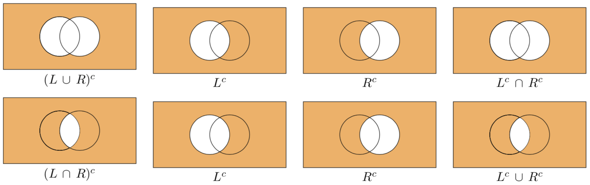

# Insiemi e operazioni insiemistiche {#sec-apx-sets}

## Concetto fondamentale di insieme

La moderna teoria degli insiemi trae origine dalla definizione proposta da Georg Cantor:

> Per insieme si intende una collezione di oggetti determinati e ben distinti della nostra intuizione o del nostro pensiero, concepiti come un tutto unico.

Sebbene la natura degli elementi possa essere arbitraria, il requisito essenziale è la possibilità di decidere univocamente se un dato oggetto appartiene o meno a un insieme. Formalmente, per ogni elemento $x$ e ogni insieme $A$, vale esattamente una delle due condizioni: $x \in A$ oppure $x \notin A$.

Due insiemi $A$ e $B$ sono detti **uguali** ($A = B$) se contengono gli stessi elementi, indipendentemente dall'ordine o da ripetizioni. Ad esempio:

$$
\{1, 2, 3\} = \{3, 1, 2\} = \{1, 3, 2\} = \{1, 1, 1, 2, 3, 3, 3\}.
$$

Se gli insiemi non condividono gli stessi elementi, si dice che sono **diversi** ($A \neq B$).

## Notazione e sottoinsiemi

Gli insiemi sono generalmente indicati con lettere maiuscole ($A, B, C, \dots$), mentre gli elementi con lettere minuscole ($a, b, c, \dots$). Un insieme finito può essere descritto in **forma tabulare**, elencando i suoi elementi tra parentesi graffe:

$$
A = \{a_1, a_2, \dots, a_n\}.
$$

Quando gli elementi sono caratterizzati da una proprietà $P(x)$, si utilizza la **notazione per comprensione**:

$$
A = \{x \mid P(x)\},
$$

che si legge "l'insieme degli $x$ tali che vale $P(x)$". Ad esempio, l'insieme dei punti sulla parabola $y = x^2 + 1$ si scrive:

$$
A = \{(x, y) \mid y = x^2 + 1\}.
$$

### Relazioni di inclusione

Dati due insiemi $A$ e $B$:

- $A$ è **sottoinsieme** di $B$ ($A \subseteq B$) se ogni elemento di $A$ appartiene anche a $B$:
  $$
  A \subseteq B \iff \forall x (x \in A \implies x \in B).
  $$

- $A$ è **sottoinsieme proprio** di $B$ ($A \subset B$) se $A \subseteq B$ ed esiste almeno un elemento di $B$ che non appartiene ad $A$:
  $$
  A \subset B \iff (A \subseteq B) \land (\exists y \in B \mid y \notin A).
  $$

L'**insieme delle parti** (o insieme potenza) di un insieme $A$, denotato con $\mathcal{P}(A)$, è l'insieme di tutti i sottoinsiemi di $A$, inclusi l'insieme vuoto $\emptyset$ e $A$ stesso. Per $A = \{a, b, c\}$:

$$
\mathcal{P}(A) = \{\emptyset, \{a\}, \{b\}, \{c\}, \{a,b\}, \{a,c\}, \{b,c\}, \{a,b,c\}\}.
$$

## Rappresentazione grafica: diagrammi di Eulero-Venn

I diagrammi di Venn (sviluppati da John Venn sulla base di idee precedenti di Eulero e Leibniz) forniscono una rappresentazione visiva intuitiva delle relazioni tra insiemi. Gli insiemi sono raffigurati come regioni chiuse del piano, tipicamente cerchi o ellissi, all'interno di un rettangolo che rappresenta l'insieme universo. Le relazioni di appartenenza, intersezione e unione diventano immediatamente evidenti attraverso l'ombreggiatura delle aree corrispondenti.


## Implementazione in R

### Appartenenza e costruzione di insiemi

In R, un insieme è tipicamente rappresentato come un vettore. La funzione `unique()` garantisce che ogni elemento compaia una sola volta, rispettando la definizione insiemistica.

```{r}
# Costruzione di un insieme
Set1 <- c(1, 2)
print(Set1)

# Da una lista con ripetizioni a un insieme
my_list <- c(1, 2, 3, 4, 1, 2)
my_set <- unique(my_list)
print(my_set)
```

L'operatore `%in%` verifica l'appartenenza di un elemento a un insieme:

```{r}
my_set <- c(1, 3, 5)
print(1 %in% my_set)   # TRUE
print(2 %in% my_set)   # FALSE
print(!(4 %in% my_set)) # TRUE (non appartenenza)
```

### Relazioni tra insiemi

Definito un universo di riferimento (ad esempio, i numeri interi da 0 a 10), è possibile esaminare relazioni di inclusione e disgiunzione.

```{r}
Univ <- 0:10
Pari <- Univ[Univ %% 2 == 0]  # {0, 2, 4, 6, 8, 10}
Dispari <- Univ[Univ %% 2 == 1] # {1, 3, 5, 7, 9}
Sottoinsieme <- c(4, 6)
Vuoto <- Univ[Univ > 10]       # numeric(0)

# Verifica relazioni
print(all(Sottoinsieme %in% Pari))        # TRUE: Sottoinsieme ⊆ Pari
print(all(Pari %in% Univ))                # TRUE: Pari ⊆ Univ
print(length(intersect(Pari, Dispari)) == 0) # TRUE: insiemi disgiunti
```

## Operazioni insiemistiche fondamentali

### Definizioni formali

1. **Intersezione**: elementi comuni a entrambi gli insiemi.
   $$
   A \cap B = \{x \mid x \in A \land x \in B\}
   $$

2. **Unione**: elementi che appartengono ad almeno uno dei due insiemi.
   $$
   A \cup B = \{x \mid x \in A \lor x \in B\}
   $$

3. **Differenza**: elementi del primo insieme che non appartengono al secondo.
   $$
   A \setminus B = \{x \mid x \in A \land x \notin B\}
   $$

4. **Complementare** (rispetto a un universo $U$):
   $$
   A^c = U \setminus A = \{x \in U \mid x \notin A\}
   $$

### Implementazione in R

```{r}
S1 <- seq(1, 10, by = 3)  # {1, 4, 7, 10}
S2 <- 1:6                 # {1, 2, 3, 4, 5, 6}

# Intersezione
intersect(S1, S2)         # {1, 4}

# Unione
union(S1, S2)             # {1, 2, 3, 4, 5, 6, 7, 10}

# Differenza
setdiff(S2, S1)           # {2, 3, 5, 6}
setdiff(S1, S2)           # {7, 10}

# Complementare (rispetto a 0:20)
S <- seq(0, 20, by = 2)   # numeri pari
S_complement <- setdiff(0:20, S) # numeri dispari
setequal(union(S, S_complement), 0:20) # TRUE
```

### Differenza simmetrica

La differenza simmetrica, denotata con $A \triangle B$, è definita come:
$$
A \triangle B = (A \setminus B) \cup (B \setminus A) = (A \cup B) \setminus (A \cap B).
$$

```{r}
sym_diff <- union(setdiff(S1, S2), setdiff(S2, S1))
# Equivalente: setdiff(union(S1, S2), intersect(S1, S2))
```

### Leggi di De Morgan

Le due leggi fondamentali che collegano unione, intersezione e complementazione:

$$
(A \cup B)^c = A^c \cap B^c, \quad
(A \cap B)^c = A^c \cup B^c.
$$

Queste identità sono facilmente visualizzabili mediante diagrammi di Venn.



## Coppie ordinate e prodotto cartesiano

Una **coppia ordinata** $(a, b)$ è un'entità in cui l'ordine degli elementi è significativo: $(a, b) \neq (b, a)$ a meno che $a = b$. Il **prodotto cartesiano** di due insiemi $A$ e $B$ è l'insieme di tutte le possibili coppie ordinate:

$$
A \times B = \{(a, b) \mid a \in A,\ b \in B\}.
$$

Esempio: $\{1, 2\} \times \{a, b, c\} = \{(1,a), (1,b), (1,c), (2,a), (2,b), (2,c)\}$.

### Implementazione in R

```{r}
A <- c("a", "b", "c")
S <- 1:3
cartesian_product <- expand.grid(A, S)
print(cartesian_product)
nrow(cartesian_product) # Cardinalità: |A| × |S| = 3 × 3 = 9
```

Il concetto si estende a $n$-uple ordinate (o tuple) e a prodotti cartesiani di $n$ insiemi, che corrispondono a array multidimensionali.

```{r}
# Potenza cartesiana: A × A × A
A <- c("Head", "Tail")
p3 <- expand.grid(A, A, A) # 2³ = 8 combinazioni
```

## Cardinalità di un insieme

La **cardinalità** di un insieme finito $A$, indicata con $|A|$, $\#(A)$ o $\mathrm{card}(A)$, rappresenta il numero di elementi distinti contenuti nell'insieme. Questa nozione quantitativa è fondamentale per descrivere la dimensione di un insieme e per calcolare la dimensione di insiemi costruiti attraverso operazioni insiemistiche.

### Proprietà della cardinalità

Per il prodotto cartesiano di due insiemi, la cardinalità segue una regola moltiplicativa:

$$
|A \times B| = |A| \cdot |B|.
$$

Questa proprietà si generalizza al prodotto cartesiano di $n$ insiemi:

$$
|A_1 \times A_2 \times \dots \times A_n| = |A_1| \cdot |A_2| \cdot \dots \cdot |A_n|.
$$

In particolare, la $k$-esima **potenza cartesiana** di un insieme $A$, definita come $A^k = A \times A \times \dots \times A$ ($k$ volte), ha cardinalità:

$$
|A^k| = |A|^k.
$$

### Implementazione in R

La seguente implementazione in R illustra il calcolo della cardinalità per la terza potenza cartesiana di un insieme:

```{r}
# Definizione dell'insieme di partenza
A <- c("Head", "Tail")

# Costruzione della terza potenza cartesiana A × A × A
p3 <- expand.grid(A, A, A)

# Output dei risultati
cat("L'insieme A³ è costituito da", nrow(p3), "elementi:\n")
print(p3)
```

L'esecuzione di questo codice produce:

- cardinalità: $|A|^3 = 2^3 = 8$ elementi;
- enumerazione esplicita di tutte le possibili terne ordinate di risultati (ad esempio, `("Head", "Head", "Head")`, `("Head", "Head", "Tail")`, ecc.).

Questo esempio dimostra come la proprietà moltiplicativa della cardinalità si traduca in una crescita esponenziale del numero di elementi nel prodotto cartesiano, un concetto cruciale in probabilità, combinatoria e nella *data science*.
