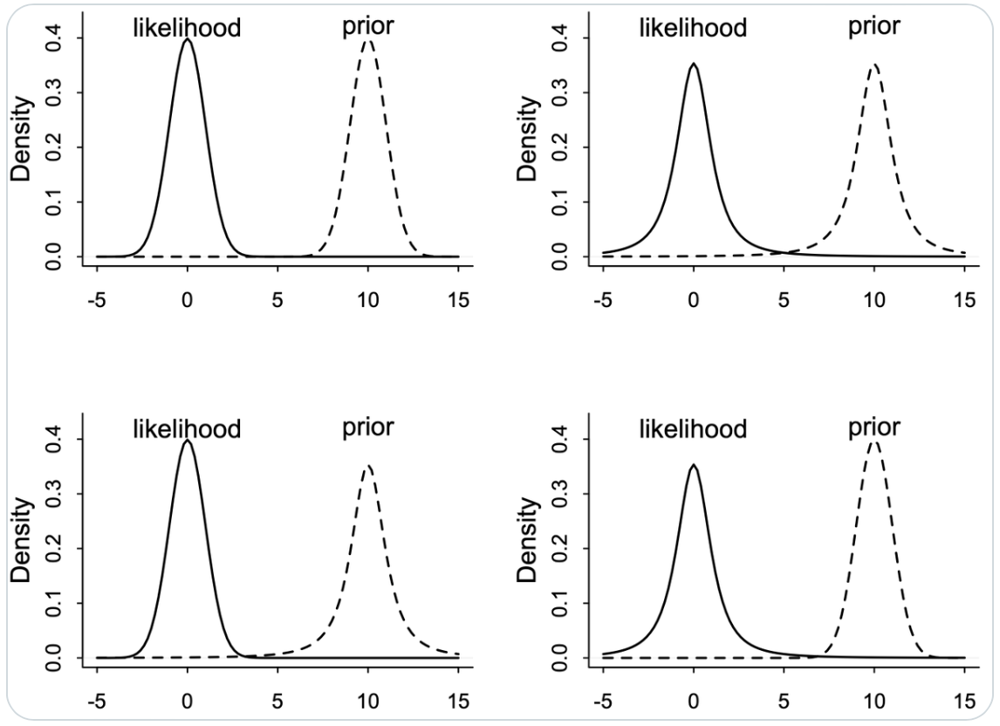
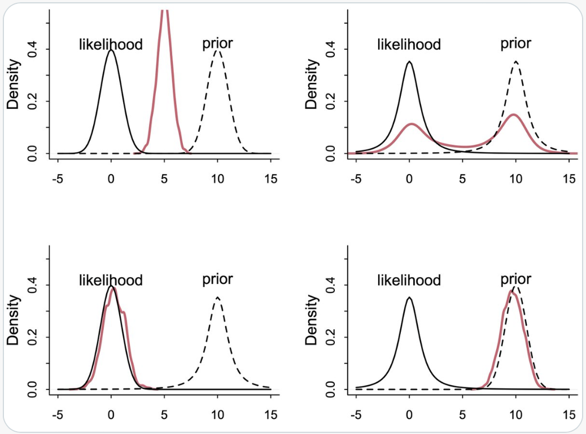

# L'influenza della distribuzione a priori {#sec-bayes-inference-prior}

## Introduzione 

In psicologia lavoriamo spesso in condizioni che mettono in difficoltà l’inferenza: campioni piccoli, misure rumorose, ed effetti veri ma modesti. In questo contesto, l’approccio bayesiano offre un vantaggio sostanziale, in quanto rende esplicito il modo in cui le nostre conoscenze pregresse, codificate nella distribuzione a priori, si combinano con l’evidenza empirica prodotta dai dati. Non si tratta di "correggere" i risultati, ma di stabilizzare l'inferenza quando l'informazione è scarsa, riducendo le sovrastime tipiche dei piccoli studi (il cosiddetto "winner's curse") e gli *errori di tipo M*, ovvero la tendenza a credere che un effetto sia più grande di quanto in realtà sia.[^M]

[^M]: *Errore di tipo M (Magnitude)*: scostamento sistematico tra la magnitudine stimata di un effetto e il suo valore reale. Nei piccoli campioni, la selezione dei risultati basata sulla significatività statistica (valore-p) tende a *sovrastimare* gli effetti. Si distingue dall'errore di tipo S (*Sign*), che riguarda l'inversione del segno dell'effetto. L'uso di distribuzioni a priori debolmente informative a code pesanti, definite su scale adimensionali (come $\beta/s$), introduce uno *shrinkage adattivo* che mitiga gli errori di tipo M quando l'evidenza è debole, preservando gli effetti genuini quando l'evidenza è forte [@gelman2014beyond; @ioannidis2005contradicted].

Questa stabilizzazione funziona davvero quando la prior è scelta sulla *scala giusta*. Se stimiamo un coefficiente $\beta$ con errore standard $s$, la quantità informativa non è $\beta$ in sé, ma il rapporto adimensionale $\xi=\beta/s$, che misura il segnale in unità di rumore. Lavorare su $\xi$ ha tre conseguenze pratiche: rende l’analisi *invariante* a cambiamenti di unità di misura, consente il confronto *coerente* tra studi diversi, e fa emergere in modo trasparente *l'influenza* della prior sulla posterior. Quando il rapporto segnale/rumore osservato $z=b/s$ è piccolo, la prior esercita una contrazione benefica verso valori plausibili; quando $|z|$ è grande, invece, è la verosimiglianza a dominare e l'influenza della prior si riduce.

Questa dinamica non è un artificio tecnico, ma un principio epistemologico: quando le nuove informazioni sono poche, è ragionevole affidarsi di più a ciò che già si conosce; quando le nuove informazioni sono molte, è ragionevole lasciar parlare i dati. In altre parole, l'approccio bayesiano non sostituisce i dati con la teoria, ma ne modula la combinazione in funzione dell'informazione disponibile.

Mappa del capitolo: prima esamineremo il processo di aggiornamento bayesiano in un esempio elementare per sviluppare l'intuizione; poi tradurremo quest'ultima in linee guida operative per scegliere prior trasparenti e difendibili; infine, discuteremo le scelte moderne, come i prior sulla scala SNR e i prior informativi provenienti da corpus, e cosa accade quando prior e verosimiglianza non sono d'accordo.

::: {.callout-note title="Convenzioni notazionali"}
-   $b$: stima puntuale (coefficiente campionario).
-   $s$: errore standard associato a $b$.
-   $z=b/s$: z-score osservato.
-   $\beta$: parametro “vero” sulla scala del modello (coefficiente).
-   $\xi=\beta/s$: *rapporto segnale/rumore (SNR)*, adimensionale.
-   $\sigma$: deviazione standard (parametro di scala).
-   $\text{Beta}(a,b)$: *distribuzione* Beta con parametri $a,b$ (attenzione: $\beta$ è un coefficiente, “Beta” è una distribuzione).
-   $\nu$: gradi di libertà (Student-$t$); 
-   $\eta$: parametro LKJ.
:::

## Panoramica del capitolo {.unnumbered .unlisted}

* **Che cosa fa la prior?** — Intuizione e ruolo nell’inferenza.
* **Come sceglierla?** — Non-informativa, debolmente informativa, informativa.
* **Quanto “pesa”?** — Dipende dalla quantità di dati (e da $|z|$).
* **Questione di scala.** — Perché conviene lavorare su $\beta/s$.
* **Coniugazione vs metodi moderni.** — Quando semplificare e quando essere flessibili.
* **Esempi in R.** — Mini-simulazioni per “vedere” l’effetto della prior.

::: {.callout-tip collapse=true}
## Prerequisiti

- Leggere il capitolo *Balance and Sequentiality in Bayesian Analyses* di *Bayes rules!*  [@Johnson2022bayesrules].
:::

::: {.callout-caution collapse=true title="Preparazione del Notebook"}

```{r}
here::here("code", "_common.R") |> 
  source()

# Load packages
if (!requireNamespace("pacman")) install.packages("pacman")
pacman::p_load(conflicted, tidytable )

conflicts_prefer(tidyr::extract)
```
:::

## Aggiornamento bayesiano nel modello Beta-Binomiale: un’analisi visiva

Il percorso di comprensione dell’inferenza bayesiana risulta notevolmente agevolato dall’osservazione diretta dell’effetto della distribuzione a priori nel processo di aggiornamento delle credenze. In questo capitolo, attraverso un approccio visivo, esamineremo il meccanismo fondamentale di trasformazione della conoscenza pregressa in conoscenza aggiornata, mantenendoci nell'ambito del modello Beta-Binomiale che, per la sua trasparenza analitica, si presta particolarmente a finalità didattiche.

Consideriamo il problema della stima del parametro $\theta$, che rappresenta la probabilità che un soggetto fornisca una risposta corretta in un compito cognitivo. In uno scenario sperimentale costituito da 9 prove di memoria, si osservano 6 risposte corrette. L’obiettivo è aggiornare le nostre convinzioni iniziali su $\theta$ alla luce di queste evidenze empiriche. In questo contesto, la distribuzione a priori formalizza lo stato di conoscenza antecedente all’osservazione dei dati, la funzione di verosimiglianza cattura l’informazione contenuta nei dati, mentre la distribuzione a posteriori sintetizza la combinazione di questi due elementi.

### Il framework coniugato Beta-Binomiale

La distribuzione Beta gode della proprietà di coniugazione rispetto alla distribuzione Binomiale, caratteristica che rende particolarmente agevole il processo di aggiornamento bayesiano:

$$
\begin{aligned}
\text{Prior: } & \theta \sim \text{Beta}(\alpha, \beta), \\
\text{Dati: } & y \sim \text{Binomiale}(n, \theta), \\
\text{Posterior: } & \theta \mid y \sim \text{Beta}(\alpha + y, \beta + n - y).
\end{aligned}
$$
La distribuzione a posteriori mantiene la forma funzionale Beta, modificandone esclusivamente i parametri. Questa proprietà consente di visualizzare immediatamente l'effetto dell'informazione empirica sulla distribuzione di probabilità.

### Visualizzazione dell’aggiornamento bayesiano

La seguente funzione facilita la visualizzazione del processo di aggiornamento bayesiano.

```{r}
plot_beta_binomial <- function(alpha, beta, y, n) {
  theta <- seq(0, 1, length.out = 100)
  prior <- dbeta(theta, alpha, beta)
  likelihood <- dbinom(y, n, theta)
  posterior <- dbeta(theta, alpha + y, beta + n - y)
  
  tibble(
    theta,
    Prior = prior / max(prior),
    Likelihood = likelihood / max(likelihood),
    Posterior = posterior / max(posterior)
  ) |>
    pivot_longer(-theta, names_to = "Distribuzione", values_to = "Densità") |>
    ggplot(aes(x = theta, y = Densità, color = Distribuzione)) +
    geom_line(size = 1.2) +
    labs(
      title = "Aggiornamento Beta–Binomiale\n(6 successi su 9)",
      x = expression(theta),
      y = "Densità (scala normalizzata)"
    ) +
    theme(legend.position = "right")
}
```

### Analisi comparativa di tre scenari 

#### Scenario A: Prior non informativa (uniforme)

```{r, fig.fullwidth=TRUE}
plot_beta_binomial(alpha = 1, beta = 1, y = 6, n = 9)
```

**Interpretazione:**  la distribuzione a priori uniforme assegna la stessa probabilità a tutti i possibili valori di $\theta$, riflettendo uno stato di incertezza totale iniziale. In questo caso, la distribuzione a posteriori coincide sostanzialmente con la funzione di verosimiglianza, poiché l'inferenza è interamente dominata dall'evidenza empirica. Questo approccio rappresenta l'equivalente bayesiano di un'analisi statisticamente "neutrale", priva di assunzioni preconcette.

#### Scenario B: Prior moderatamente informativa

```{r, fig.fullwidth=TRUE}
plot_beta_binomial(alpha = 2, beta = 2, y = 6, n = 9)
```

**Interpretazione:**  la distribuzione a priori esprime una moderata credenza che il valore di $\theta$ si collochi intorno a 0.5, pur mantenendo una notevole variabilità. Dopo l'aggiornamento, la distribuzione a posteriori si sposta verso i valori suggeriti dai dati (0.67), ma conserva una forma più "conservativa" rispetto allo scenario precedente, con una media a posteriori di circa 0.62. La distribuzione a priori esercita quindi un effetto stabilizzante sulla stima, mitigando un'eccessiva fiducia nell'evidenza campionaria.

#### Scenario C: Prior fortemente informativa

```{r, fig.fullwidth=TRUE}
plot_beta_binomial(alpha = 2, beta = 5, y = 6, n = 9)
```

**Interpretazione:**  in questo scenario, la distribuzione a priori riflette una convinzione pregressa piuttosto forte che $\theta$ assuma valori modesti (media a priori = 0.29). Nonostante l’evidenza empirica suggerisca un valore di 0.67, la distribuzione a posteriori mantiene una posizione intermedia (intorno a 0.45), dimostrando come  convinzioni iniziali forti possano resistere parzialmente al contraddittorio dei dati. Questo comportamento è esattamente ciò che ci si aspetta quando si dispone di una solida base teorica a sostegno dell’ipotesi iniziale.

### Considerazioni metodologiche e implicazioni

Il confronto dei tre scenari evidenzia come la scelta della distribuzione a priori influenzi in modo sistematico e interpretabile il processo inferenziale.  Quando la prior è *uniforme* sull’intervallo [0,1], essa non esprime preferenze iniziali specifiche: la distribuzione a posteriori rispecchia fedelmente la funzione di verosimiglianza, concentrandosi attorno al valore 0.67. Quando la prior *esclude a priori* prestazioni inferiori al caso (valori <0.5), la distribuzione a posteriori ignora completamente la regione sinistra dell’intervallo: la credenza iniziale "orienta" la stima verso valori più elevati rispetto a quanto suggerirebbe la sola evidenza empirica. Quando la prior è *moderatamente informativa*, concentrando la plausibilità attorno a 0.5 senza essere eccessivamente rigida, la distribuzione a posteriori rappresenta un *compromesso razionale*: più vicina a 0.67 che a 0.5, ma meno estrema della sola verosimiglianza.

Dal punto di vista concettuale, la distribuzione a priori funziona come un insieme di *osservazioni pseudo-empiriche*. Nel caso specifico del modello Beta-Binomiale, questa interpretazione risulta particolarmente chiara: i parametri $(\alpha,\beta)$ della distribuzione a priori si sommano rispettivamente ai successi e agli insuccessi osservati, e la media a posteriori diventa una *media ponderata* tra la convinzione iniziale e l’evidenza empirica. Il peso relativo della distribuzione a priori diminuisce all’aumentare del numero di osservazioni $n$: con un campione limitato la prior esercita un’influenza notevole, con campioni più ampi il suo contributo si attenua progressivamente. 

Questo meccanismo è formalmente noto come "shrinkage" (contrazione), ma la sua essenza concettuale è intuitiva: in presenza di informazioni deboli, si evitano stime eccessivamente estreme; in presenza di informazioni robuste, prevale il segnale dei dati. Su questi principi elementari si basano i modelli statistici più complessi, come i modelli di regressione, i modelli lineari generalizzati e i modelli gerarchici. Una volta compreso che la distribuzione a posteriori rappresenta una negoziazione razionale tra conoscenza pregressa ed evidenza empirica, l’aspetto tecnico dell’analisi bayesiana si riduce a un problema di progettazione appropriata della distribuzione a priori piuttosto che a una mera questione di manipolazione matematica.

### Il ruolo della distribuzione a priori come evidenza fittizia

Per chiarire, esaminiamo nel dettaglio il modello Beta-Binomiale. La distribuzione a priori nel modello Beta-Binomiale può essere concettualizzata come un "bagaglio di osservazioni fittizie" che precedono la raccolta dei dati empirici. La quantità $\alpha + \beta$, nota come _sample size equivalente_ della prior, quantifica il grado di fiducia riposto nelle convinzioni iniziali:

- con $\alpha + \beta = 2$, la distribuzione a priori possiede un'influenza modesta, equiparabile all'impatto di due osservazioni preliminari;
- con $\alpha + \beta = 20$, per esempio, la prior incorpora un peso informativo rilevante, corrispondente a venti osservazioni virtuali, e richiede pertanto un'evidenza empirica sostanziale per essere modificata in modo significativo.

Questa caratteristica spiega come distribuzioni a priori eccessivamente informative possano sovrastare il segnale dei dati: si comportano come se fosse già disponibile un'ampia base di riscontri empirici, anche in assenza di dati consolidati.

#### La meccanica del compromesso bayesiano

L'equilibrio tra conoscenza pregressa e evidenza empirica emerge chiaramente dalla struttura della media a posteriori:

$$
\mathbb{E}[\theta \mid D] = \frac{\alpha+\beta}{\alpha+\beta+n} \cdot \underbrace{\frac{\alpha}{\alpha+\beta}}_{\text{media a priori}} + \frac{n}{\alpha+\beta+n} \cdot \underbrace{\frac{y}{n}}_{\text{media campionaria}}
$$

Questa formulazione rivela che la stima finale è una media ponderata tra la credenza iniziale e l'evidenza osservata, dove i coefficienti di ponderazione sono determinati dal rapporto tra la forza della distribuzione a priori ($\alpha+\beta$) e la dimensione del campione ($n$).

- in contesti _data-rich_ $(n \gg \alpha+\beta)$, il peso dominante è attribuito all'evidenza empirica;
- in situazioni _data-poor_ $(n \ll \alpha+\beta)$, la distribuzione a priori esercita un effetto stabilizzante, riducendo la variabilità delle stime.

### Un'analogia con l'apprendimento umano

Questo comportamento statistico trova un preciso riscontro nel modo in cui la conoscenza umana si evolve:

- di fronte a esperienze limitate o ambigue, tendiamo a fare affidamento sulle nostre convinzioni preesistenti (prior cognitivi);
- man mano che accumuliamo numerose e coerenti evidenze, le nostre convinzioni iniziali si aggiornano progressivamente, perdendo gradualmente la loro influenza relativa.

L'inferenza bayesiana formalizza questo stesso principio: la distribuzione a priori incarna la conoscenza consolidata derivante dalla teoria e dalla letteratura scientifica, mentre i dati rappresentano la nuova evidenza empirica. Man mano che le osservazioni aumentano, le nostre conclusioni statistiche, proprio come le convinzioni personali, diventano sempre più fondate sull'evidenza fattuale, riducendo l'influenza delle assunzioni iniziali.

## L’influenza della distribuzione a priori in relazione all’informazione disponibile

Come discusso in precedenza, l’influenza della distribuzione a priori non è costante, ma varia dinamicamente in funzione di due fattori determinanti: la quantità e la qualità delle informazioni contenute nei dati osservati. Questa proprietà costituisce una differenza fondamentale rispetto all'inferenza frequentista. Quando i dati sono numerosi e precisi, è la verosimiglianza a dominare il processo inferenziale, rendendo le stime sostanzialmente robuste rispetto a scelte di prior ragionevolmente diverse. Al contrario, in contesti caratterizzati da dati limitati o rumorosi, condizione frequente nella ricerca psicologica, la distribuzione a priori acquisisce un peso determinante e, se adeguatamente specificata, può diventare uno strumento di regolarizzazione benefica. Attraverso un esempio applicativo, esamineremo nel dettaglio qui di seguito l’influenza dell’ampiezza campionaria.

### Due scenari empirici a confronto

Si consideri uno studio volto a valutare l’efficacia di un intervento di mindfulness nella riduzione dei livelli di stress.

In presenza di un campione di dimensioni ridotte – ad esempio, 15 partecipanti con elevata variabilità individuale – la stima del coefficiente di regressione potrebbe risultare pari a $b = -0.4$, con un errore standard $s = 0.3$. In tal caso, il segnale risulterebbe debole ($z = -1.33$) e i dati, presi singolarmente, fornirebbero un’evidenza ambigua. In questo contesto, una distribuzione a priori debolmente informativa, come ad esempio, $\beta \sim \mathrm{Normal}(0, 1)$,  eserciterebbe un’importante azione di regolarizzazione, attirando la stima verso lo zero e prevenendo una sovrastima dell’efficacia dell’intervento.

Al contrario, in presenza di un campione ampio – ad esempio, 500 partecipanti – a parità di stima puntuale, l’errore standard si ridurrebbe drasticamente ($s = 0.04$), portando a un valore $z = -10$. In questo scenario, la verosimiglianza risulterebbe estremamente concentrata e dominerebbe incontrastata il processo inferenziale, rendendo trascurabile l'impatto della distribuzione a priori sulla stima finale, anche adottando prior differenti.

Il principio fondamentale che emerge è tanto semplice quanto rilevante: *l’influenza della distribuzione a priori è inversamente proporzionale all’informazione contenuta nei dati*. In presenza di dati ricchi e precisi, la prior perde rilevanza, mentre in situazioni di scarse informazioni o elevata ambiguità empirica, essa diventa un ingrediente essenziale per inferenze credibili e riproducibili.

### Una simulazione concettuale

Il seguente codice mostra come la varianza della distribuzione a posteriori diminuisca con l'aumentare del numero di osservazioni e come il contributo relativo della distribuzione a priori diminuisca progressivamente.

```{r, fig.width=7, fig.asp=0.5, out.width="100%"}
# Parametri "veri"
theta_true <- 0.6

# Prior: Beta(2,2) - moderatamente informativa (centrata su 0.5)
alpha <- 2; beta <- 2

# Tre campioni di diversa dimensione
n_values <- c(10, 50, 500)

# Inizializza una lista vuota per memorizzare i risultati
posterior_list <- list()

# Calcola le densità posteriori per ogni valore di n
for (i in seq_along(n_values)) {
  n <- n_values[i]
  
  # simuliamo dati binomiali (successi)
  k <- round(theta_true * n)
  
  # posteriori Beta(a+k, b+n-k)
  theta <- seq(0, 1, length.out = 400)
  dens <- dbeta(theta, alpha + k, beta + n - k)
  
  # Aggiungi alla lista
  posterior_list[[i]] <- data.frame(theta = theta, dens = dens, n = n)
}

# Combina tutti i dataframe in uno solo
posterior_densities <- do.call(rbind, posterior_list)

ggplot(posterior_densities, aes(x = theta, y = dens, color = factor(n))) +
  geom_line(size = 1.2) +
  labs(
    title = "Effetto della numerosità campionaria\nsulla distribuzione a posteriori",
    x = expression(theta),
    y = "Densità",
    color = "n (campione)"
  ) +
  theme(legend.position = "right")
```

**Interpretazione dei risultati:** con un campione di $n = 10$, la distribuzione a posteriori appare ampia e poco concentrata, il che significa che i dati contengono un'informazione limitata e che la distribuzione a priori, centrata attorno a 0.5, esercita un’influenza visibile sulla stima. Con $n = 50$, la distribuzione a posteriori si restringe, segnalando un contributo maggiore dei dati osservati. Con $n = 500$, la distribuzione a posteriori risulta stretta e centrata in prossimità del valore vero $\theta = 0.6$, e l’influenza della distribuzione a priori diventa trascurabile.

### Valore euristico del modello Beta-Binomiale

Il modello Beta-Binomiale offre una "palestra concettuale" particolarmente efficace per comprendere i principi fondamentali dell’inferenza bayesiana. Esso illustra in modo trasparente il processo attraverso cui l’evidenza empirica trasforma le credenze iniziali, mostrando come la quantità di informazioni disponibili modifichi l’influenza della distribuzione a priori. Questa comprensione fornisce le basi concettuali necessarie per affrontare modelli statistici più complessi e strutturati.

## Dalla teoria alla pratica: strategie per la scelta della distribuzione a priori

Dopo aver esaminato il ruolo della distribuzione a priori nel processo inferenziale bayesiano, affrontiamo ora la questione operativa fondamentale: come selezionare una distribuzione a priori appropriata in contesti applicativi. Secondo la proposta metodologica di @zwet2022proposal, la costruzione di una distribuzione a priori ben calibrata richiede di rispondere sequenzialmente a tre domande chiave: *su quale scala è definito il parametro? quale intervallo di valori è plausibile? quanto è forte la nostra convinzione iniziale?*. Gli aspetti formali, come la forma della distribuzione, i gradi di libertà e il comportamento delle code, emergono naturalmente da queste scelte concettuali di base.

### La scelta della scala: fondamento dell'invarianza inferenziale

La determinazione della scala appropriata è una decisione preliminare essenziale, poiché il concetto di "neutralità" di una distribuzione a priori è intrinsecamente legato alla scala di misurazione. Per i coefficienti di regressione e i contrasti tra le medie, la scala adimensionale $\xi = \beta/s$, che esprime l'effetto in termini di rapporto segnale-rumore, è la scelta preferibile. Questa parametrizzazione garantisce l'invarianza dell'inferenza rispetto a riscalamenti e ricodifiche delle variabili, consentendo confronti metodologicamente fondati tra studi diversi.

Nei modelli lineari generalizzati (GLM), la distribuzione a priori deve essere specificata sulla scala della funzione di collegamento: nella regressione logistica, la plausibilità riguarda i logit (log-odds); nei modelli di Poisson per i dati di conteggio, invece, interessa il logaritmo del parametro di intensità. La standardizzazione dei predittori, pratica ampiamente raccomandata, conferisce un'interpretazione immediata e confrontabile alla distribuzione a priori, indipendentemente dall'unità di misura originale.

### Determinazione della plausibilità: integrazione di teoria ed evidenza

Una volta stabilita la scala di riferimento, è necessario delimitare l'ordine di grandezza dei valori plausibili per il parametro. Questa determinazione integra considerazioni teoriche, evidenza empirica consolidata e conoscenza disciplinare contestuale.

- per i predittori standardizzati, gli effetti con $|\beta| > 1-2$ sono generalmente considerati di entità sostanziale;
- nei modelli logit, variazioni di pochi punti nella scala dei log-odds rappresentano tipicamente effetti rilevanti;
- nei modelli per dati di conteggio, un coefficiente nullo corrisponde all'assenza di effetto moltiplicativo e costituisce spesso un punto di ancoraggio ragionevole.

La distribuzione a priori non deve né può "indovinare" il valore vero del parametro, ma deve delimitare lo spazio dei valori plausibili, escludendo quelli teoricamente o empiricamente impossibili e assegnando minore plausibilità ai valori estremi o improbabili.

### Calibrazione dell'informatività: dal principio di parsimonia allo shrinkage adattivo

La quantificazione del grado di informatività rappresenta la fase finale del processo. In assenza di solide evidenze pregresse, è generalmente preferibile adottare distribuzioni a code pesanti sulla scala $\xi$ — come la distribuzione t di Student con pochi gradi di libertà o la distribuzione di Cauchy centrata sullo zero — che realizzano uno shrinkage adattivo: contrazione pronunciata per effetti di modesta entità (piccolo valore di $|z|$), interferenza minima per effetti sostanziali (grande valore di $|z|$).

Quando è disponibile una letteratura consolidata, una distribuzione a priori informativa, ad esempio una distribuzione normale centrata su una stima meta-analitica con deviazione standard che rifletta l'incertezza aggregata, costituisce una scelta metodologicamente fondata. Tuttavia, tale scelta deve sempre essere accompagnata da una verifica predittiva a priori: le assunzioni iniziali generano dati simulati compatibili con la fenomenologia del dominio applicativo? Se le simulazioni producono tempi di reazione negativi, probabilità esterne all'intervallo [0,1] o frequenze di eventi empiricamente implausibili, la distribuzione a priori è mal specificata, in quanto viola i vincoli semantici del dominio di ricerca.

Dopo l'analisi, un'analisi di sensibilità sistematica, variando l'ampiezza, la localizzazione e la forma della distribuzione a priori, quantifica la robustezza delle conclusioni rispetto alle scelte compiute. Se i risultati mostrano una marcata dipendenza dalle specifiche della distribuzione a priori, ciò non rappresenta un "fallimento" dell'approccio bayesiano, ma fornisce un'informazione preziosa sulla fragilità dell'evidenza empirica. Comunicare che un risultato dipende criticamente da assunzioni non perfettamente verificabili rappresenta, in molti contesti applicativi, la conclusione più onesta e utile dal punto di vista metodologico e scientifico per il progresso cumulativo della conoscenza.

::: {.callout-tip title="Guida pratica alla scelta"}
1. **Identifica la scala e i suoi vincoli.**  
   Inizia chiedendoti: qual è l'unità di misura del parametro? Ci sono limiti naturali (ad esempio, ≥0 per una deviazione standard, [0,1] per una probabilità)? È possibile trasformare il parametro in una scala adimensionale, come il rapporto segnale-rumore?

2. **Stima l'ordine di grandezza plausibile.**  
   Quale intervallo di valori ha un senso sostantivo per il tuo fenomeno?  
   *Esempio concreto:* se la variabile dipendente ha una deviazione standard di circa 1, allora effetti di regressione con $|\beta|$ compreso tra 1 e 2 possono già essere considerati sostanziali.

3. **Attingi alla letteratura consolidata:**  
   meta-analisi e studi precedenti forniscono un prezioso punto di riferimento. Utilizzale per ancorare la tua distribuzione a priori a intervalli di valori empiricamente plausibili e ridurre l'arbitrarietà della scelta.

4. **Calibra con cura il grado di informatività:**  
   decidi quanto "peso" assegnare all'ipotesi di assenza di effetto. Le distribuzioni a code pesanti, come la t di Student, offrono un buon compromesso, permettendo di regolarizzare le stime senza escludere la possibilità di effetti inattesi e di grande entità.

**Regola empirica:** in assenza di una solida letteratura pregressa, la scelta più sicura è spesso una *distribuzione $t$ (o una Cauchy) sul rapporto $\beta/s$*. Questa scelta applica una regolarizzazione *adattiva*, che corregge le sovrastime quando l'evidenza è ambigua, senza però soffocare i segnali forti e ben supportati dai dati.
:::

::: {.callout-tip collapse=true title="Verifica fondamentale: *Prior Predictive Check*"}
Prima di analizzare i dati reali, immagina di generare un mondo possibile basato esclusivamente sulle tue assunzioni a priori: "Quali dati potrei ragionevolmente osservare se le mie distribuzioni a priori rispecchiassero la realtà?" Questo esercizio di simulazione, chiamato "prior predictive check", ti aiuta a verificare che le tue scelte probabilistiche siano coerenti con la conoscenza empirica del dominio psicologico in esame.

Attraverso questa procedura, puoi:

- individuare specificazioni problematiche che assegnano probabilità eccessiva a valori di parametro irrealistici;
- valutare la coerenza sostanziale tra le tue assunzioni iniziali e le regolarità osservate nella letteratura;
- scartare le specificazioni che genererebbero pattern di dati incompatibili con l'esperienza consolidata.

Esempio applicativo: modello normale con media $\mu$ (incognita) e deviazione standard nota $\sigma=1$.

```{r}
set.seed(1)
n <- 30                    # dimensione del campione
mu_prior_sd <- 1.0         # dispersione a priori per la media
S <- 2000                  # numero di simulazioni

# Campionamento dei valori della media dalla distribuzione a priori
mu_samp <- rnorm(S, mean = 0, sd = mu_prior_sd)

# Simulazione dei dati: per ogni mu, genera un campione e calcola la media
ybar_rep <- sapply(mu_samp, function(m) mean(rnorm(n, mean = m, sd = 1)))

# Intervallo di credibilità predittivo al 95%
quantile(ybar_rep, c(.025, 0.5, .975))
```

**Interpretazione dei risultati:** con un campione di $n=30$ e $\sigma=1$, una distribuzione a priori $\mu \sim \text{Normal}(0,1)$ genera medie campionarie per lo più comprese tra -0.7 e 0.7. Se il tuo fenomeno di studio tipicamente produce effetti con medie attorno a $\pm 1.5$ (ad esempio, differenze standardizzate di media entità), questa prior potrebbe essere *troppo restrittiva*. In tal caso, considera di aumentare la dispersione a priori (`mu_prior_sd`) per adattarla all'ampiezza degli effetti suggeriti dalla letteratura.
:::

### Errori comuni da evitare

- **L'illusione della neutralità:** le distribuzioni uniformi sono spesso scelte nella convinzione che siano "oggettive" o "neutrali". In realtà, non sono invarianti rispetto alle trasformazioni di scala (ad esempio, passando da una scala lineare a una logaritmica) e tendono a concentrare la massa probabilistica in regioni di parametri del tutto implausibili per il fenomeno in esame.

- **Incoerenza con la realtà empirica:** specificare distribuzioni a priori che assegnano una probabilità non trascurabile a esiti impossibili (come tempi di reazione negativi o probabilità al di fuori dell'intervallo [0,1]) compromette la credibilità dell'intero modello. La prior deve sempre rispettare i vincoli naturali del dominio di ricerca.

- **Asimmetrie concettualmente ingiustificate:** se l'interpretazione dei risultati cambia radicalmente semplicemente ricodificando una variabile (per esempio, scambiando i livelli A e B di un fattore), ciò indica che la distribuzione a priori non è stata definita su una scala appropriata (per esempio, una scala adimensionale o di link). Le inferenze dovrebbero essere sostanzialmente invarianti rispetto a tali scelte puramente operative.

### Trasparenza metodologica

- [ ] Scala del parametro chiaramente specificata.
- [ ] Giustificazione concisa della scelta (letteratura, plausibilità).
- [ ] *Prior predictive check* con statistiche rilevanti.
- [ ] Analisi di sensibilità con prior alternative.

## Tipologie di distribuzioni a priori

Esaminiamo le quattro principali categorie di distribuzioni a priori.

### 1. Priori non informative

**Scopo:** minimizzare l'influenza delle convinzioni preesistenti e lasciare che sia l'evidenza empirica a guidare completamente l'inferenza.

**Esempio psicologico:**
immagina di voler indagare per la prima volta la relazione tra l'arousal fisiologico e i pensieri intrusivi. In assenza di letteratura pregressa, potresti adottare una prior uniforme che considera tutte le correlazioni come ugualmente probabili:
$$
\rho \sim \text{Uniform}(-1, 1)
$$

**Avvertenza:**
il termine "non informativa" può essere fuorviante: una prior uniforme su una scala non è necessariamente uniforme su un'altra (ad esempio, una trasformazione non lineare). In psicologia, questo approccio rischia inoltre di attribuire probabilità non trascurabili a valori estremi che, nella realtà dei fenomeni mentali, si manifestano raramente.

### 2. Priori debolmente informative

**Scopo:** imporre dei vincoli di plausibilità di buon senso, evitando stime irrealistiche senza però precludere ai dati di esprimersi.

**Esempio:** in uno studio sull'efficacia di un breve intervento di mindfulness per l'ansia, ci si aspetta un effetto positivo ma contenuto. Una prior debolmente informativa potrebbe essere:
$$
\beta \sim \text{Normal}(0, 1)
$$
Questa scelta comunica: "riteniamo più probabile un effetto nullo o modesto, ma non escludiamo del tutto effetti più sostanziali ($|\beta| \approx 2$), se i dati li supporteranno chiaramente".

**Vantaggio:** funge da stabilizzatore statistico, soprattutto in campioni piccoli, prevenendo la sovrastima di effetti spurii dovuta al rumore campionario.

### 3. Priori informative

**Scopo:** incorporare esplicitamente evidenze consolidate derivate da studi precedenti, meta-analisi o conoscenza teorica.

**Esempio:** Una solida meta-analisi indica che la terapia cognitivo-comportamentale produce una riduzione media dei sintomi depressivi pari a $d = 0.5$. Possiamo formalizzare questa conoscenza nel modo seguente:
$$
\beta \sim \text{Normal}(0.5, 0.2)
$$
Questa distribuzione esprime una convinzione ragionevolmente forte riguardo al valore atteso, pur ammettendo un margine di incertezza.

**Vantaggio:** nei campioni di piccole dimensioni, questa strategia sfrutta la saggezza cumulata della letteratura per produrre stime più robuste e generalizzabili.

### 4. Priori empiriche (o da corpus)

**Scopo:** calibrare la distribuzione a priori direttamente sui dati quantitativi di un insieme di studi affini, creando un valore predefinito basato sull'evidenza per un determinato ambito di ricerca.

**Esempio:** analizzando la distribuzione degli z-score ($z = b/s$) riportati in decine di studi che utilizzano l'*Experience Sampling Method* (ESM), è possibile stimare una distribuzione empirica che rappresenti il tipico rapporto segnale-rumore in questo ambito. Questa distribuzione diventa quindi una prior informata dai dati per un nuovo studio ESM.

### Visualizzare le differenze

Per apprezzare concretamente l'influenza delle diverse tipologie di prior sulle nostre assunzioni iniziali, è utile visualizzarne le forme a confronto. Il codice seguente traccia tre distribuzioni a priori per il coefficiente di regressione $\beta$, ciascuna rappresentativa di una delle categorie discusse in precedenza: una distribuzione uniforme (non informativa), una distribuzione Normale(0, 1) (debolmente informativa) e una distribuzione Normale(0.5, 0.2) (informativa).

```{r, fig.width=7, fig.asp=0.5, out.width="100%"}
beta_grid <- seq(-3, 3, length.out = 500)
priors <- tibble(
  beta = rep(beta_grid, 3),
  tipo = rep(c("Uniforme", "Normal(0,1)", "Normal(0.5,0.2)"), each = length(beta_grid)),
  dens = c(
    dunif(beta_grid, -3, 3),
    dnorm(beta_grid, 0, 1),
    dnorm(beta_grid, 0.5, 0.2)
  )
)

ggplot(priors, aes(x = beta, y = dens, color = tipo)) +
  geom_line(linewidth = 1.2) +
  labs(
    title = "Confronto tra distribuzioni a priori per un coefficiente β",
    x = expression(beta),
    y = "Densità",
    color = "Tipo di Prior"
  ) +
  theme(legend.position = "right")
```

**Interpretazione della figura:**

*   La prior **uniforme** assegna una densità costante a tutti i valori nell'intervallo, senza esprimere alcuna preferenza predefinita.
*   La prior **Normal(0,1)** esprime uno *scetticismo moderato*, concentrando la probabilità attorno all'ipotesi di assenza di effetto ($\beta=0$), ma ammettendo una plausibilità non trascurabile per effetti di moderata entità.
*   La prior **Normal(0.5,0.2)** incorpora un'*aspettativa precisa*: l'effetto positivo di modesta entità ($\beta \approx 0.5$) è il più plausibile e le probabilità sono molto basse per i valori lontani da questo punto.

### In sintesi

| Tipo di prior              | Quando usarla                      | Vantaggi                   | Rischi / limiti                                                   |
| -------------------------- | ---------------------------------- | -------------------------- | ----------------------------------------------------------------- |
| **Non informativa**        | Nessuna conoscenza pregressa       | Lascia parlare i dati      | Instabile con campioni piccoli                                    |
| **Debolmente informativa** | Effetti plausibili ma incerti      | Regolarizza, evita outlier | Può sembrare arbitraria                                           |
| **Informativa**            | Evidenze forti da studi precedenti | Integra conoscenza teorica | Può “spingere” troppo la stima se i dati sono pochi o discordanti |

## Priori informativi basati su *corpora* di studi (scala SNR)

### La proposta metodologica: miscele di distribuzioni

@zwet2022proposal propongono l'uso di distribuzioni a priori informative basate su *corpora* di studi, implementate mediante miscele di distribuzioni. A titolo esemplificativo, consideriamo una distribuzione a priori costituita da una miscela simmetrica di due componenti normali centrate sullo zero.

I pesi ($\pi_1, \pi_2$) rappresentano la proporzione relativa di effetti "piccoli" rispetto a quelli "più sostanziali" presenti nella letteratura esistente, mentre le scale ($\tau_1, \tau_2$)catturano l'ampiezza tipica degli effetti per ciascuna componente, espressa nella scala SNR. I valori numerici specifici (ad esempio, $\pi_1 = 0.6$, $\pi_2 = 0.4$, $\tau_1 = 0.7$, $\tau_2 = 4.0$) si ottengono mediante la calibrazione su un corpus di studi metodologicamente affini che condividono un disegno sperimentale, un outcome e scale di misura simili. Tecnicamente, questo processo consiste nell'adattare una miscela di distribuzioni alla distribuzione osservata ($z = b/s$) nella letteratura esistente.

In sintesi, il corpus fornisce una stima empirica della frequenza e dell'ampiezza degli effetti in un determinato ambito di ricerca e funge da distribuzione a priori di riferimento per $\beta/s$.

### Esempio applicativo: interpretazione dei risultati

Consideriamo uno studio che riporta una stima $b = 0.30$ con errore standard $s = 0.20$ ($z = 1.5$). Applicando la distribuzione a priori di riferimento descritta, la stima regolarizzata dell'effetto potrebbe risultare, ad esempio, approssimativamente
$
\hat{\beta}_{\text{reg}} \approx 0.22
$
corrispondente a una *riduzione del 25-30%* rispetto alla stima classica di 0.30.

Questo risultato illustra un principio fondamentale: quando il segnale osservato è debole ($|z| \approx 1-2$), la prior "da corpus" modera la stima verso valori più plausibili, riducendo gli errori di grandezza. Al contrario, quando il segnale è forte (valori elevati di $|z|$), la regolarizzazione diventa trascurabile e prevale l'evidenza empirica.

### Implementazione pratica: linee guida operative

La costruzione di una distribuzione a priori basata su corpus segue tre fasi principali. In primo luogo, per l'area di interesse, si raccolgono dagli studi disponibili i valori di $z = b/s$, avendo cura di evitare duplicati e considerando la dipendenza tra esiti multipli. In seguito, si adatta una miscela di distribuzioni  normali centrate sullo zero per determinare i pesi ($\pi$) e le scale ($\tau$) delle componenti. Infine, nel nuovo studio, lo z-score osservato viene combinato automaticamente con la miscela stimata, ottenendo una regolarizzazione adattiva che risulta più intensa per i segnali deboli e più lieve per quelli forti.

### Vantaggi e ambiti di applicazione

Questo approccio offre diversi vantaggi metodologici. L'utilizzo di una scala adimensionale ($\beta/s$) garantisce coerenza metodologica e comparabilità tra studi. Inoltre, mitiga gli errori di tipo M in contesti con campioni limitati, pur rispettando pienamente l'evidenza quando l'informazione è abbondante. Si rivela particolarmente utile come standard disciplinare quando esiste un corpus omogeneo di studi su compiti e risultati simili.

### Avvertenze metodologiche

Tuttavia, è necessario considerare alcune importanti avvertenze metodologiche. Il corpus deve essere metodologicamente omogeneo (stessi costrutti, disegni sperimentali e scale) e il più possibile rappresentativo, includendo quindi repliche e registered reports, non solo i risultati statisticamente significativi. Inoltre, la prior "da corpus" non sostituisce i prior predictive check: è necessario verificare sempre la compatibilità delle assunzioni con lo spazio dei dati osservabili.

### Strategia in assenza di evidenza pregressa

Quando non si dispone di un corpus consolidato (situazione che si verifica in caso di mancanza di meta-analisi rilevanti o studi sufficientemente analoghi), è consigliabile adottare una distribuzione a code pesanti per lo SNR, come la seguente:
$$
\frac{\beta}{s} \sim \mathrm{Cauchy}(0, 1).
$$
La distribuzione di Cauchy presenta code più marcate rispetto alla distribuzione normale, implementando un profilo di regolarizzazione ottimale caratterizzato da una forte regolarizzazione per effetti di modesta entità ($|z| < 2$) e da un'interferenza minima per effetti sostanziali ($|z| > 3$). Questa caratteristica rende la distribuzione di Cauchy (0,1) un prior di riferimento ideale, in quanto offre robustezza metodologica, trasparenza operativa e funzionalità automatica senza richiedere impostazioni personalizzate.

### Considerazioni pratiche sull'uso di distribuzioni a code pesanti

La scelta $\xi \sim \text{Cauchy}(0,1)$ rappresenta un'opzione robusta come valore predefinito; tuttavia, in modelli complessi o con algoritmi MCMC computazionalmente onerosi, è opportuno considerare troncamenti ragionevoli (ad esempio, $\|\xi\|\le 10)$ o distribuzioni $t$ con $\nu\in[3,7]$. Questo approccio protegge dai valori estremi senza compromettere l'esplorazione dello spazio dei parametri.

### Visualizzazione dell'effetto di regolarizzazione

Per illustrare visivamente l'effetto della regolarizzazione, confrontiamo la stima classica $b$ con la stima regolarizzata $\hat{\beta}_{\text{shrink}}$ per diversi valori di $z$.

```{r, fig.width=7, fig.asp=0.5, out.width="100%"}
#| label: shrinkage-z
#| fig-cap: "Effetto dello shrinkage sullo SNR per prior Normal su ξ con scale diverse."
shrinkage <- function(z, tau) (tau^2 / (1 + tau^2)) * z

z_grid <- seq(-5, 5, length.out = 200)
tau1 <- 0.7
tau2 <- 4.0

data_sh <- tibble(
  z = rep(z_grid, 2),
  shrinked = c(shrinkage(z_grid, tau1), shrinkage(z_grid, tau2)),
  prior = rep(c("Effetti piccoli (τ=0.7)", "Effetti grandi (τ=4.0)"), each = length(z_grid))
)

ggplot(data_sh, aes(x = z, y = shrinked, color = prior)) +
  geom_line(linewidth = 1.1) +
  geom_abline(slope = 1, intercept = 0, linetype = "dashed") +
  labs(
    title = "Effetto dello shrinkage sul rapporto segnale/rumore",
    x = "z osservato (b/s)",
    y = "z shrinked\n(posterior mean)"
  ) +
  theme(legend.position = "right")
```

L'interpretazione del grafico rivela che la linea tratteggiata, che rappresenta l'identità, corrisponde all'assenza di regolarizzazione. Le linee colorate mostrano invece che, per valori piccoli di $|z|$, la stima tende a zero, mentre per valori grandi di $|z|$ tende alla linea di identità, recuperando così il comportamento dell'inferenza classica quando l'evidenza empirica è solida.

### Sintesi delle raccomandazioni

Una distribuzione a priori "da corpus" sulla scala SNR implementa una regola di regolarizzazione automatica e trasparente che protegge dalle sovrastime quando l'evidenza è fragile, preserva il segnale quando l'evidenza è solida e mantiene le inferenze coerenti nell'ambito della ricerca.

| Situazione                    | Prior consigliata su $\beta/s$ | Effetto pratico               |
| ----------------------------- | ------------------------------ | ----------------------------- |
| Nessun corpus disponibile     | Cauchy(0,1)                    | Default robusto, heavy-tailed |
| Corpus di studi simili        | Miscela simmetrica di Normali  | Shrinkage adattivo            |
| Effetti noti molto piccoli    | Normal(0,1) o Normal(0,0.5)    | Riduce sovrastime             |
| Effetti potenzialmente grandi | t₃(0,2) o Cauchy(0,2)          | Permette code più ampie       |

### Regolarizzazione adattiva e rapporto segnale-rumore

Il fenomeno di regolarizzazione osservato può essere interpretato chiaramente in questa cornice concettuale: quando il rapporto segnale-rumore (SNR) è basso, a causa di una ridotta numerosità campionaria o di un'elevata variabilità, la distribuzione a priori riduce l'ampiezza delle stime per evitare sovrastime sistematiche. Al contrario, quando l'SNR è elevato, la prior cede il passo all'evidenza empirica, interferendo in modo minimo con le stime. Questo meccanismo rappresenta una mediazione automatica e trasparente tra la conoscenza pregressa e le nuove osservazioni, ottimizzando il compromesso tra stabilità statistica e aderenza ai dati.

### Quadro riassuntivo dell'influenza della prior

| Situazione                      | Influenza del prior | Effetto pratico              | Analogia psicologica       |
| ------------------------------- | ------------------- | ---------------------------- | -------------------------- |
| Campione piccolo, dati rumorosi | Alta                | Stabilizza, evita sovrastime | Convinzioni iniziali forti |
| Campione medio                  | Moderata            | Compromesso equilibrato      | Aggiornamento parziale     |
| Campione grande                 | Bassa               | I dati dominano              | Conoscenza appresa         |

## Trasformazioni e scala dei parametri

Un aspetto cruciale, spesso sottovalutato nell'inferenza bayesiana, riguarda la non invarianza delle distribuzioni a priori rispetto alle trasformazioni di scala. Affermare di "utilizzare una distribuzione a priori uniforme" non significa non esprimere alcuna opinione preliminare: il comportamento della stessa distribuzione a priori può cambiare radicalmente quando si modifica l'unità di misura o si ricodifica una variabile.

### Un caso esemplificativo

Consideriamo uno studio sulla soddisfazione lavorativa misurata su una scala da 1 a 10. Un ricercatore potrebbe assegnare una distribuzione a priori uniforme all'effetto $\beta$, ipotizzando che tutti i valori compresi tra -10 e +10 abbiano la stessa probabilità.

Supponiamo ora di ricodificare la variabile dipendente su una scala da 0 a 100. Se manteniamo la stessa distribuzione a priori uniforme senza adattarne i parametri, il suo impatto sull'inferenza cambia sostanzialmente: l'intervallo copre ora valori di ordine di grandezza superiore, rendendo la distribuzione a priori implicitamente molto più diffusa.

La lezione fondamentale è che una distribuzione a priori non può essere "piatta" su tutte le scale contemporaneamente. Risulta "piatta" esclusivamente rispetto alla scala specifica sulla quale è stata definita.

### L'importanza della scala nella ricerca psicologica

Numerosi parametri dei modelli psicologici, come le differenze tra le medie, i coefficienti di regressione o le saturazioni fattoriali, dipendono intrinsecamente dalla scala di misurazione del costrutto.  Un coefficiente $\beta$ = 0.5 può assumere significati diversi a seconda che la variabile sia espressa in punti grezzi, in punteggi $z$ o in percentili. Per questa ragione, quando possibile, è preferibile specificare le distribuzioni a priori su quantità adimensionali, come:

- il rapporto segnale-rumore $\beta/s$;
- coefficienti standardizzati, espressi in unità di deviazione standard.

Queste grandezze sono direttamente confrontabili tra studi diversi e mantengono la loro interpretazione anche quando la scala di misura cambia.

### Illustrazione mediante un caso concreto

Supponiamo di osservare un effetto $b$ = 4 con errore standard $s$ = 2 su una scala da 0 a 10. Se riscaliamo la variabile a 0-100 (moltiplicando tutti i valori per 10), otteniamo $b'$ = 40 e $s'$ = 20, ma lo $z$-score rimane identico:

$z = b/s = 4/2 = 2$,  

$z' = b'/s' = 40/20 = 2$.

Questa osservazione porta a una conclusione metodologica importante: se la distribuzione a priori è definita su $\beta/s$ (SNR), l'inferenza bayesiana rimane invariata; se invece si utilizza una distribuzione a priori uniforme definita direttamente su $\beta$, i risultati cambiano drasticamente, poiché il supporto e la densità della distribuzione a priori non si adattano automaticamente alla nuova scala.

### Visualizzazione dell'effetto della trasformazione di scala

```{r, fig.width=7, fig.asp=0.5, out.width="100%"}
# Likelihood su due scale (0-10 e 0-100)
b <- 4; s <- 2; a <- 10
grid1 <- seq(-20, 20, length.out = 1000)
grid2 <- seq(-200, 200, length.out = 1000)

like1 <- dnorm(grid1, mean = b, sd = s)
like2 <- dnorm(grid2, mean = a*b, sd = a*s)

# Uniforme e Cauchy su β/s
prior_unif1 <- dunif(grid1, -20, 20)
prior_unif2 <- dunif(grid2, -200, 200)
prior_cauchy1 <- dcauchy(grid1 / s)
prior_cauchy2 <- dcauchy(grid2 / (a*s))

tibble(
  beta = c(grid1, grid2/a),
  density = c(like1 * prior_unif1, like2 * prior_unif2),
  prior = rep(c("Uniforme (cambiata di scala)", "Uniforme (non cambiata)"), each = length(grid1))
) |>
  ggplot(aes(x = beta, y = density, color = prior)) +
  geom_line(size = 1.1) +
  labs(
    title = "Effetto del cambio di scala su una prior uniforme",
    x = expression(beta),
    y = "Densità (likelihood × prior)"
  ) +
  theme(legend.position = "right")
```

L'interpretazione del grafico rivela che quando la distribuzione a priori viene trasformata coerentemente con il cambio di scala, l'inferenza bayesiana produce risultati invarianti; se invece la distribuzione a priori non viene adattata, il risultato dell'inferenza si modifica sostanzialmente, alterando sia la stima puntuale che l'incertezza associata.

### L'approccio metodologicamente corretto: priorità alle quantità adimensionali

Per garantire coerenza e comparabilità tra studi che utilizzano scale di misura diverse, è fondamentale adottare il seguente approccio:

1.  specificare la distribuzione a priori sul rapporto segnale-rumore, definendola direttamente sulla quantità adimensionale $\beta/s$ anziché sul parametro $\beta$ nella sua scala originaria;
2.  utilizzare distribuzioni simmetriche, come la normale con media 0 e deviazione standard 1, la $t$ di Student con $\nu$ piccolo (per esempio, 3-7) o la Cauchy con media 0 e deviazione standard 1;
3.  assumere l'indipendenza dalla scala, considerando $\beta/s$ come indipendente, o almeno non sistematicamente correlato, con $s$.

Questo approccio garantisce che operazioni apparentemente innocue, come l'inversione della codifica di un contrasto (per esempio, passare da "condizione sperimentale vs. controllo" a "controllo vs. condizione sperimentale"), producano un semplice cambio di segno nella stima dell'effetto senza alterare la sostanza delle conclusioni inferenziali o la loro incertezza.

### Quadro riassuntivo degli effetti delle trasformazioni

Il seguente schema sintetizza gli effetti di diverse trasformazioni sulle distribuzioni a priori:

| Tipo di trasformazione | Esempio                   | Effetto su una prior uniforme | Effetto su una prior su $\beta/s$ |
| ---------------------- | ------------------------- | ----------------------------- | --------------------------- |
| Cambio unità           | 0-10 → 0-100              | Cambia la forma e la densità  | Nessuna differenza          |
| Inversione segno       | A-B → B-A                 | Cambia il centro della prior  | Solo inversione del segno   |
| Standardizzazione      | Punteggi grezzi → z-score | Cambia la scala numerica      | Nessuna differenza          |

### Verifica empirica mediante simulazione

Il seguente esperimento dimostra che una distribuzione a priori uniforme su $\beta$ non è invariante al cambio di scala, mentre una distribuzione a priori definita su $\beta/s$ (SNR) produce la stessa inferenza anche quando cambia l'unità di misura.

Consideriamo la stima di un effetto $b$ = 4 con errore standard $s$ = 2 su una scala da 0 a 10 e successivamente ricodifichiamo il tutto su una scala da 0 a 100 (moltiplicando per 10).

```{r}
# Stima e incertezza (scala 0-10)
b <- 4; s <- 2
# Fattore di riscalamento: da 0-10 → 0-100
a <- 10
b2 <- a * b; s2 <- a * s

# Griglie dei possibili valori di β nelle due scale
grid1 <- seq(-20, 20, length.out = 1001)
grid2 <- seq(-200, 200, length.out = 1001)

# Likelihood in ciascuna scala
like1 <- dnorm(grid1, mean = b,  sd = s)
like2 <- dnorm(grid2, mean = b2, sd = s2)

# (A) Prior uniforme su β (non invariante)
prior_unif1 <- rep(1/length(grid1), length(grid1))
prior_unif2 <- rep(1/length(grid2), length(grid2))

post_unif1 <- like1 * prior_unif1; post_unif1 <- post_unif1 / sum(post_unif1)
post_unif2 <- like2 * prior_unif2; post_unif2 <- post_unif2 / sum(post_unif2)

# (B) Prior Cauchy su β/s (invariante)
prior_cauchy1 <- dcauchy(grid1 / s) / s
prior_cauchy2 <- dcauchy(grid2 / s2) / s2

post_cauchy1 <- like1 * prior_cauchy1; post_cauchy1 <- post_cauchy1 / sum(post_cauchy1)
post_cauchy2 <- like2 * prior_cauchy2; post_cauchy2 <- post_cauchy2 / sum(post_cauchy2)

# Medie posteriori (riportate alla scala originale)
m_unif1 <- sum(grid1 * post_unif1)
m_unif2 <- sum(grid2 * post_unif2) / a
m_cauchy1 <- sum(grid1 * post_cauchy1)
m_cauchy2 <- sum(grid2 * post_cauchy2) / a

tibble(
  Prior = c("Uniforme su β", "Cauchy su β/s"),
  Media_orig = c(m_unif1, m_cauchy1),
  Media_rescaled = c(m_unif2, m_cauchy2)
)
```

### Risultati della simulazione

I risultati della simulazione confermano le aspettative teoriche:

| Prior             | Media (scala 0-10) | Media dopo rescaling (riportata a 0-10) | Proprietà                   |
| ----------------- | ------------------ | --------------------------------------- | --------------------------- |
| **Uniforme su $\beta$** | Variabile          | Cambia sensibilmente                    | Dipendenza dalla scala      |
| **Cauchy su $\beta/s$** | Coincidente        | Coincidente                             | Invarianza rispetto alla scala |

### Considerazioni conclusive

Le distribuzioni a priori non possiedono una "neutralità" intrinseca, ma acquisiscono un significato solo quando sono definite su una scala in cui il parametro è interpretabile dal punto di vista psicologico. La distribuzione a priori uniforme, sebbene apparentemente "neutra", cambia il suo comportamento in base all'unità di misura, mentre la distribuzione a priori definita su $\beta/s$ risulta equivariante e produce gli stessi risultati a prescindere dalla scala o dalla ricodifica lineare utilizzata.

In pratica, definire la distribuzione a priori sul rapporto segnale-rumore garantisce risultati coerenti, confrontabili e indipendenti da convenzioni arbitrarie di scala, rappresentando una scelta metodologicamente solida per la ricerca psicologica.

## Priors nel flusso di lavoro moderno: principi pratici essenziali

Storicamente, la scelta delle distribuzioni a priori è stata spesso dettata più da esigenze di calcolabilità che da considerazioni sostanziali, privilegiando forme "congiunte" che consentissero soluzioni analitiche. Oggi, gli algoritmi computazionali moderni, come HMC/MCMC, hanno rivoluzionato questa pratica, consentendo di definire prior che riflettano la plausibilità del fenomeno studiato piuttosto che la convenienza matematica. Questo cambiamento epistemologico sposta l'attenzione dalla ricerca di una famiglia di distribuzioni "chiusa" all'identificazione della scala concettualmente più adeguata e dalla trattabilità analitica alla coerenza sostanziale.

Nella pratica operativa, tre principi fondamentali guidano le scelte.

1. La scala è prioritaria: le inferenze devono essere robuste rispetto a scelte arbitrarie di codifica o di unità di misura. Pertanto, è preferibile definire la prior su quantità adimensionali, come il rapporto segnale-rumore ($\xi=\beta/s$). Su questa scala, una distribuzione simmetrica e a code pesanti (come la Cauchy o la $t$ con pochi gradi di libertà) realizza una "regolarizzazione adattiva": mitiga le sovrastime quando l'evidenza è debole, mentre interferisce minimamente con le stime ben supportate dai dati. Nei GLM, è cruciale ricordare che la prior opera sulla scala del link (logit, log, identità, ecc.). La standardizzazione dei predittori facilita l'interpretazione immediata delle ipotesi e rende i risultati più facilmente confrontabili.

2. Default robusti, ma dichiarati. Quando non si dispone di un corpus solido, è necessario fare scelte di buon senso, esplicite e difendibili. Una prior heavy-tailed su (Cauchy(0,1) o $t_{\nu}(0,1)$ con $\nu \in \{3,7\}$ è un buon punto di partenza; per i coefficienti logit dei predittori standardizzati, una distribuzione normale con media 0 e varianza 2.5 funziona bene, mentre per i link log una distribuzione normale con media 0 e varianza 1 mantiene effetti ragionevoli. Nei modelli gerarchici, scale come la half-$t$ moderata producono il parziale pooling desiderabile: gli estremi sono attenuati quando l’incertezza è elevata e le differenze sono preservate quando l’evidenza è presente.

3. Verifiche predittive e sensibilità: l'ABC della trasparenza. Prima di analizzare i dati, è opportuno porsi la seguente domanda: "Con queste prior, che mondo genererei?". Il prior predictive check risponde esattamente a questa domanda e smaschera le specificazioni che producono dati implausibili. Dopo l'analisi, una rapida analisi di sensibilità (con prior più strette o più larghe) chiarisce quanto le conclusioni dipendano dalle ipotesi iniziali. Non si tratta di un orpello metodologico, ma di ciò che rende il lavoro replicabile e comunicabile.

In sintesi, le distribuzioni coniugate conservano un valore essenzialmente didattico per la comprensione dei meccanismi formali dell'inferenza bayesiana. Nella pratica metodologica contemporanea, l'approccio si è evoluto verso principi operativi distinti che non richiedono l'uso esclusivo delle distribuzioni coniugate. Tali principi si articolano secondo una precisa gerarchia operativa: la preferenza per le scale adimensionali, quando possibile; l'uso di distribuzioni a code pesanti per una regolarizzazione conservativa; e l'adozione sistematica di verifiche predittive come requisito minimo di trasparenza metodologica.

## Conflitto tra prior e verosimiglianza

Finora abbiamo visto come la distribuzione a priori e la verosimiglianza si combinino armoniosamente per produrre la posterior. Ma cosa succede quando non sono d'accordo? Cosa succede, cioè, quando la prior assegna un'alta probabilità a una regione del parametro, mentre i dati "spingono" in un'altra direzione?

Questo tipo di conflitto è molto istruttivo, in quanto mostra fino a che punto il modello è coerente con le nostre ipotesi e quanta "resistenza" i dati offrono nel modificarle.

### 1. Il problema dell’intuizione

Come sottolinea McElreath, il punto centrale è che non possiamo fidarci dell'intuizione: anche combinazioni semplici di prior e likelihood possono produrre posteriori molto diverse da quelle che ci aspetteremmo.

Per illustrare questo concetto, McElreath propone quattro piccoli esperimenti mentali, riportati in queste due figure.

{width="80%"}

Nella prima figura sono visibili quattro coppie di prior e likelihood apparentemente simili, ma con esiti molto diversi. La seconda figura mostra le corrispondenti posteriori risultanti.

{width="80%"}

### 2. I quattro scenari a confronto

#### (A) Prior Normale, Likelihood Normale — il caso “armonioso”

* $y \sim \text{Normal}(\mu,1)$
* $\mu \sim \text{Normal}(10,1)$

Qui prior e likelihood hanno la *stessa forma* (campane gaussiane) e lo *stesso grado di concentrazione*. Il risultato è prevedibile: la posterior si colloca *a metà strada* tra prior e dati, con una varianza ridotta. Questa è la situazione ideale, quella che tutti immaginano quando pensano a Bayes come a un "compromesso".

Interpretazione psicologica: i dati e la teoria "parlano la stessa lingua". Le convinzioni si aggiornano senza attriti.

#### (B) Prior Student-t, Likelihood Student-t — entrambi con code spesse

* $y \sim \text{Student}(2,\mu,1)$
* $\mu \sim \text{Student}(2,10,1)$

Le code spesse della distribuzione t attribuiscono alta plausibilità anche ai valori estremi. Sia la prior che la likelihood "accettano" deviazioni grandi.
La posterior è quindi ampia e incerta: non si concentra su nessuna possibilità in particolare, ma ne lascia aperte molte.

Messaggio: quando entrambe le fonti sono "tolleranti", il risultato è un'elevata incertezza. Non si tratta di un errore, ma di una rappresentazione fedele della scarsa informazione disponibile.

Analogia psicologica: se sia i dati sia le convinzioni teoriche sono vaghi, non possiamo aspettarci una conclusione precisa.

#### (C) Prior Student-t, Likelihood Normale — prior “larga”, dati “stretti”

* $y \sim \text{Normal}(\mu,1)$
* $\mu \sim \text{Student}(2,10,1)$

La distribuzione normale ha code sottili e penalizza molto i valori estremi.
La prior $t(2)$, invece, è aperta e lascia spazio ai valori estremi.

Risultato: la posterior è dominata dai dati, perché la likelihood è molto più concentrata. Il prior, pur essendo heavy-tailed, ha un'influenza minima.

Messaggio: quando i dati sono precisi, la prior si adegua. L'aggiornamento bayesiano "comprende" che l'evidenza è forte.

Analogia psicologica: è come quando osserviamo un effetto molto chiaro: la nostra convinzione iniziale si aggiorna facilmente, anche se era vaga.

#### (D) Prior Normale, Likelihood Student-t — prior “stretta”, dati “rumorosi”

* $y \sim \text{Student}(2,\mu,1)$
* $\mu \sim \text{Normal}(10,1)$

Questa è la situazione opposta alla precedente. La distribuzione $t$ di Student ha code spesse, il che significa che accetta anche osservazioni lontane, rumorose o anomale. La prior, invece, è rigida e "sfiduciata" nei confronti dei valori estremi. La posterior resta quindi vicina al centro della prior: i dati, pur ampi, non riescono a spostarla molto.

Messaggio: una prior troppo stretta può dominare i dati, specialmente quando questi sono rumorosi. In pratica, l'analisi diventa "cieca" rispetto alle deviazioni inaspettate.

Analogia psicologica: è come quando uno schema teorico molto rigido impedisce di vedere i risultati al di fuori di esso.

### 3. La lezione di fondo

Questi esempi ci mostrano che il comportamento di Bayes dipende dalla forma relativa di prior e likelihood, non solo dai loro centri o dalle loro medie.

| Prior     | Likelihood | Esito                           | Diagnosi           |
| --------- | ---------- | ------------------------------- | ------------------ |
| Normale   | Normale    | Posterior regolare, prevedibile | equilibrio         |
| Student-t | Student-t  | Posterior larga e incerta       | bassa informazione |
| Student-t | Normale    | I dati vincono                  | dati forti         |
| Normale   | Student-t  | Il prior domina                 | teoria rigida      |

### 4. Implicazioni pratiche

* Un **prior troppo stretto** può soffocare l’informazione dei dati.
* Un **prior troppo vago** può rendere la stima inutilmente incerta.
* Un **prior flessibile** (ad esempio heavy-tailed) offre un compromesso robusto: protegge dagli outlier, ma lascia spazio ai dati quando sono chiari.

### 5. Morale per il ricercatore

Non basta "avere una prior": bisogna verificarne la compatibilità con i dati. Questo è il senso delle analisi di sensibilità e dei prior predictive checks: verificare come le nostre assunzioni interagiscono con la verosimiglianza prima di guardare i risultati.

Nel mondo della psicologia, questo equivale a chiedersi: "Le mie aspettative teoriche e i dati che posso raccogliere sono coerenti tra loro?" Se la risposta è negativa, non si tratta di un fallimento, ma di una scoperta preziosa.

## Limiti e buone pratiche

L’uso delle distribuzioni a priori è uno degli aspetti più potenti, ma anche più delicati, dell’inferenza bayesiana. Come per ogni strumento potente, il rischio non è tanto quello di commettere errori di calcolo, quanto piuttosto quello di interpretare male il significato delle scelte effettuate. Questa sezione raccoglie alcune buone pratiche che aiutano a mantenere l’analisi rigorosa e trasparente.

### 1. Costruire un corpus “onesto”

Quando si utilizza un corpus di studi precedenti per definire un prior (ad esempio per l’SNR $\beta/s$), è essenziale che i dati di riferimento siano rappresentativi e non distorti:

* includere repliche e *registered reports*, non solo studi pubblicati;
* evitare la selezione dei soli risultati “positivi” (bias di pubblicazione);
* documentare chiaramente da quali studi e con quali criteri è costruito il corpus.

In psicologia, un corpus ben costruito è più utile di qualsiasi prior sofisticato, perché rende le analisi cumulative e riproducibili, evitando di perpetuare stime gonfiate o inaffidabili.

### 2. L’assunzione “$s$ noto” e il suo ruolo pratico

Nel costruire un prior sull'SNR, si assume spesso che l'errore standard $s$ sia noto o stimato con buona approssimazione. Questo compromesso è utile perché permette di definire i priors in termini di grandezze comparabili tra studi. Successivamente, il modello completo può rilassare questa ipotesi e trattare $s$ come un parametro stimato.

Regola pratica: trattare $s$ come "dato" è accettabile nella fase di costruzione del prior, ma non deve diventare un vincolo rigido nella modellazione successiva.

### 3. Dipendenza dal numero di osservazioni

Poiché l'errore standard $s$ dipende dal numero di casi $n$, il prior costruito sull'SNR è indirettamente legato a $n$. Ciò significa che, se i dati vengono aggiornati in più fasi (analisi sequenziale), il prior potrebbe non essere perfettamente coerente.

La soluzione pragmatica è che, in psicologia, dove i campioni sono spesso piccoli, questa incoerenza è trascurabile rispetto ai vantaggi della regolarizzazione adattiva. È meglio un prior "pratico ma realistico" piuttosto che una neutralità fittizia.

### 4. Specificare chiaramente l’ambito del prior

Un prior non è universale, ma vale solo all’interno di un ambito concettuale e metodologico ben definito. Ad esempio:

- un prior per gli studi EMA sulla self-compassion non è adatto agli esperimenti di decisione con rinforzo;
- un prior per l’SNR in studi sui tempi di reazione non è adatto alle scale Likert.

Regola aurea: indicare sempre per cosa è stato pensato un prior, ovvero il tipo di disegno, la variabile dipendente e la scala di misura. Questo aumenta la trasparenza e previene inferenze fuori contesto.

### 5. Verificare sempre la sensibilità

Dopo aver specificato un prior, è fondamentale verificare quanto i risultati dipendano da esso.

- confrontare la posterior con prior alternativi (più stretti, più larghi o centrati altrove);
- controllare come cambiano la media e gli intervalli di credibilità;
- discutere apertamente eventuali differenze.

In termini psicologici, se la conclusione cambia drasticamente quando si cambia il prior, significa che i dati da soli non sono ancora convincenti. Questo è un risultato utile, non un errore.

### 6. Prior heavy-tailed come impostazione predefinita robusta.

In assenza di conoscenze pregresse solide, una prior heavy-tailed (ad esempio una Cauchy su $\beta/s$) rappresenta una scelta prudente.

- protegge dalle sovrastime con pochi dati;
- lascia che siano i dati a dominare quando l'informazione aumenta.
- garantisce la coerenza di scala tra studi diversi.

È il "default del default": una strategia di regolarizzazione semplice, comprensibile e applicabile in molti contesti psicologici.

### 7. Pensare al prior come a un modello teorico

Un buon prior non è solo una "forma di distribuzione", ma un'ipotesi teorica esplicita. Specificarlo significa dichiarare ciò che riteniamo plausibile e quanto siamo disposti a lasciarci sorprendere dai dati.

In psicologia, questo rappresenta un vantaggio epistemologico: i modelli diventano luoghi di dialogo tra teoria e dati e le assunzioni non sono più implicite o nascoste nei test frequentisti.

### In sintesi

| Principio               | Cosa implica in pratica                      |
| ----------------------- | -------------------------------------------- |
| Corpus onesto           | Basi empiriche trasparenti                   |
| $s$ trattato come noto  | Compromesso utile per costruire prior su SNR |
| Dipendenza da $n$       | Incoerenza minima, vantaggio alto            |
| Ambito definito         | Evita l’uso improprio del prior              |
| Analisi di sensibilità  | Verifica della robustezza delle conclusioni  |
| Prior heavy-tailed      | Default prudente e coerente                  |
| Prior = modello teorico | Connessione esplicita tra ipotesi e dati     |

## Riflessioni conclusive {.unnumbered .unlisted}


L'inferenza bayesiana non è solo una procedura statistica, ma un dialogo metodologicamente strutturato tra teoria ed esperienza. Ogni distribuzione a priori incorpora un frammento di conoscenza pregressa, esplicita, criticabile e migliorabile attraverso l'evidenza empirica. Questo approccio riconosce che l'analisi dei dati non avviene nel vuoto epistemologico, ma si sviluppa all'interno di un contesto teorico che informa e guida l'interpretazione dei risultati.

La relazione dinamica tra informazione pregressa ed evidenza empirica rappresenta uno degli aspetti più importanti di questo approccio metodologico. In condizioni di scarsità informativa, quando i dati disponibili sono limitati o ambigui, le distribuzioni a priori esercitano un'influenza determinante sul processo inferenziale, incorporando in modo trasparente le conoscenze teoriche ed esperienziali accumulate. Al contrario, quando l'evidenza empirica diventa abbondante e precisa, è la verosimiglianza a dominare il processo, mentre il contributo della distribuzione a priori tende a ridursi progressivamente. Questa proprietà garantisce che l'approccio bayesiano non imponga rigidamente le convinzioni iniziali, ma specifichi esplicitamente il peso dell'informazione pregressa, rendendo trasparente il grado di dipendenza delle nostre conclusioni dalle assunzioni di partenza.

La regolarizzazione verso valori plausibili, particolarmente rilevante quando l'evidenza empirica è debole o ambigua, rappresenta un rigore epistemico fondamentale. Questo meccanismo non solo riduce sistematicamente gli errori di grandezza nelle stime, ma contribuisce anche a migliorare la replicabilità dei risultati scientifici, prevenendo le sovrastime che spesso si verificano in contesti caratterizzati da elevata variabilità campionaria.

Ogni distribuzione a priori rappresenta, in ultima analisi, un'ipotesi teorica formalizzata che dichiara esplicitamente ciò che riteniamo plausibile prima di osservare i dati e quanto siamo disposti a rivedere tali convinzioni alla luce dell'evidenza empirica. In questa prospettiva, l'analisi statistica non è più una procedura meccanica, ma diventa parte integrante del ragionamento scientifico, e la scelta delle distribuzioni a priori diventa un momento cruciale di riflessione metodologica.

L'approccio bayesiano supera la tradizionale dicotomia tra "fidarsi dei dati" e "credere nella teoria", mostrando come questi due elementi possano essere combinati in modo coerente, proporzionato e trasparente. La vera forza dell'inferenza bayesiana risiede infatti nella sua onestà epistemologica: essa non presume di essere neutrale o libera da assunzioni, ma esplicita chiaramente il punto di partenza e mantiene una costante disponibilità a rivedere le convinzioni iniziali attraverso un processo di aggiornamento sequenziale basato sull'evidenza empirica. Questa trasparenza metodologica rappresenta un contributo fondamentale non solo per l'avanzamento della conoscenza scientifica, ma anche per la costruzione di una pratica di ricerca più consapevole e cumulativa.

::: {.callout-important title="Problemi" collapse="true"}
L'obiettivo di questo esercizio è comprendere come la distribuzione a priori influenzi la distribuzione a posteriori a seconda della grandezza del campione. Utilizzeremo dati raccolti della *Satisfaction With Life Scale (SWLS)*, categorizzandoli in base a una soglia e analizzando la proporzione di risposte che superano tale soglia con un approccio bayesiano.

*Fase 1: Raccolta e categorizzazione dei dati*

1. Ogni studente utilizza i valori della scala SWLS che sono stati raccolti dal suo gruppo TPV.
2. Si sceglie una *soglia* arbitraria (ad esempio, un punteggio superiore a 20 indica "elevata soddisfazione").
3. Si calcola la proporzione di persone con punteggi superiori alla soglia:

   $$
   \hat{p} = \frac{k}{n}
   $$
   
   dove $k$ è il numero di persone con SWLS sopra la soglia e $n$ è la dimensione del campione (circa 15).

*Fase 2: Inferenza Bayesiana con un Prior Mediamente Informativo*

4. Si assume una distribuzione Beta come prior per la proporzione di persone con SWLS sopra la soglia:

   $$
   p \sim \text{Beta}(a, b)
   $$
   
   dove $a = 2$ e $b = 2$, un prior mediamente informativo (distribuzione simmetrica centrata su 0.5).
   
5. Si calcola la distribuzione a posteriori utilizzando la coniugazione della Beta con la distribuzione binomiale:

   $$
   p \mid D \sim \text{Beta}(a + k, b + n - k)
   $$
   
6. Si calcolano:

   - *Stima puntuale* della proporzione (valore atteso della Beta a posteriori):
   
     $$
     E[p \mid D] = \frac{a + k}{a + b + n}
     $$
     
   - *Intervallo di credibilità (CI al 95%)*, utilizzando i quantili della distribuzione Beta a posteriori.

*Fase 3: Analisi con un Campione Più Grande*

7. Si ripete lo stesso esercizio, ma immaginando che la stessa proporzione $\hat{p}$ provenga da un campione di *n = 1000*.

8. Si calcola la nuova distribuzione a posteriori:

   $$
   p \mid D \sim \text{Beta}(a + k', b + n' - k')
   $$
   con $k' = \hat{p} \times 1000$.
   
9. Si ricalcolano stima puntuale e intervallo di credibilità.

*Fase 4: Confronto e Interpretazione*

10. Si confrontano le due distribuzioni a posteriori:

    - Come cambia la varianza della distribuzione a posteriori?
    - Come cambia l'influenza del prior?
    - Qual è la differenza nella precisione della stima puntuale e dell'intervallo di credibilità?
    
11. Si discute come, all'aumentare del campione, l'influenza della distribuzione a priori diminuisce, facendo emergere il ruolo della likelihood.

*Consegna:*
caricare su Moodle il file .qmd compilato in pdf.
:::

::: {.callout-note collapse=true title="Informazioni sull'ambiente di sviluppo"}
```{r}
sessionInfo()
```
:::

## Bibliografia {.unnumbered .unlisted}
