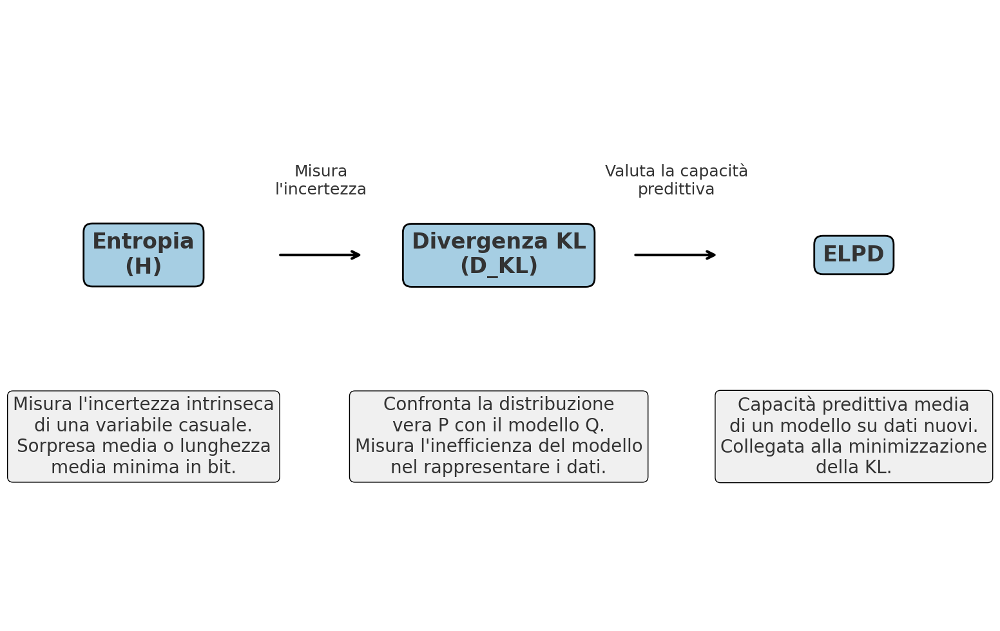

# Entropia e informazione di Shannon {#sec-entropy-shannon-information}

::: {.callout-note appearance="minimal"}
Nel contesto della teoria della probabilità, l’**entropia** fornisce una misura quantitativa dell’incertezza associata a una distribuzione di probabilità. Essa quantifica quanto sia difficile prevedere l’esito di una variabile aleatoria prima di osservare il dato, data la sola informazione contenuta nella distribuzione stessa.

Consideriamo, ad esempio, la previsione della risposta di uno studente a una domanda a scelta multipla. In assenza di informazioni sulla sua preparazione, l’ipotesi più prudente, e informativamente meno impegnativa, consiste nell’attribuire la stessa probabilità a tutte le opzioni di risposta. Questa scelta corrisponde a una distribuzione di *massima entropia*, poiché rappresenta la situazione di massima incertezza compatibile con le informazioni disponibili. Al contrario, se sapessimo che lo studente è molto preparato e fornisce la risposta corretta con una probabilità prossima a 1, la nostra incertezza sarebbe minima e, di conseguenza, anche il valore dell’entropia risulterebbe prossimo al minimo. La formalizzazione matematica di questa relazione tra distribuzione di probabilità e incertezza predittiva costituisce il fondamento del concetto di entropia informativa.

L’entropia può essere ulteriormente chiarita considerando due casi limite lungo un continuo di incertezza. Da un lato, il lancio di una moneta perfettamente equilibrata rappresenta un sistema ad *alta entropia*: i due esiti sono equiprobabili e nessuna previsione è preferibile a un’altra, realizzando il massimo teorico di incertezza per una variabile binaria. All’estremo opposto, il comportamento stereotipato di un paziente che fornisce sempre la stessa risposta rappresenta un sistema a *entropia pressoché nulla*: l’esito è deterministico e l’incertezza associata alla previsione è trascurabile. Questi esempi illustrano come l’entropia non misuri la casualità in senso colloquiale, ma la dispersione della massa di probabilità e, quindi, il grado di incertezza intrinseco del modello probabilistico.
:::

### Panoramica del capitolo {.unnumbered .unlisted}

- Introdurre il concetto di informazione e la sua unità di misura (bit). 
- Definire l'entropia come media della sorpresa di Shannon. 
- Interpretare l'entropia in termini di incertezza e capacità di codifica.  
- Stimare l'entropia da distribuzioni teoriche e da campioni osservati.  
- Collegare l'entropia alla codifica di Huffman e al limite teorico di compressione.  

::: {.callout-tip collapse=true}
## Prerequisiti

- Per i concetti di base sulla teoria dell'informazione, si rimanda ai primi due capitoli di  *Information Theory: A Tutorial Introduction* [@stone2022information].
:::

::: {.callout-caution collapse=true title="Preparazione del Notebook"}

```{r}
#| output: false
here::here("code", "_common.R") |> 
  source()

library(igraph)
library(ggraph)
library(tidygraph)

# Funzione per calcolare la lunghezza media del codice di Huffman
huffman_encoding <- function(probabilities) {
  # Crea la "coda con priorità" iniziale come lista di liste
  heap <- lapply(names(probabilities), function(sym) list(probabilities[[sym]], list(sym, "")))

  # Funzione per ordinare la heap per probabilità (peso)
  sort_heap <- function(heap) {
    heap[order(sapply(heap, function(x) x[[1]]))]
  }

  # Costruzione dell'albero di Huffman
  while (length(heap) > 1) {
    heap <- sort_heap(heap)
    lo <- heap[[1]]
    hi <- heap[[2]]
    heap <- heap[-c(1, 2)]

    # Aggiunge i prefissi "0" e "1" ai codici
    for (i in seq_along(lo)[-1]) {
      lo[[i]][[2]] <- paste0("0", lo[[i]][[2]])
    }
    for (i in seq_along(hi)[-1]) {
      hi[[i]][[2]] <- paste0("1", hi[[i]][[2]])
    }

    merged <- c(list(lo[[1]] + hi[[1]]), lo[-1], hi[-1])
    heap <- append(heap, list(merged))
  }

  # Estrai la lista finale dei simboli e codici
  final <- heap[[1]][-1]
  names(final) <- sapply(final, function(x) x[[1]])

  # Crea dizionario con codici
  huffman_dict <- lapply(final, function(x) x[[2]])

  # Calcolo della lunghezza media del codice
  avg_length <- sum(mapply(function(sym, code) {
    probabilities[[sym]] * nchar(code)
  }, names(huffman_dict), huffman_dict))

  return(list(avg_length = avg_length, codes = huffman_dict))
}
```
:::

## Che cos'è l'informazione?

Nel contesto della teoria dell’informazione, l’**informazione** può essere definita come la **riduzione dell’incertezza** riguardo a un insieme di esiti possibili. Osservare un evento informativo significa restringere lo spazio delle alternative plausibili, rendendo più precisa la nostra conoscenza dello stato del sistema.

L’unità di misura fondamentale dell’informazione è il *bit*, che corrisponde alla quantità di informazione ottenuta quando si risolve una scelta tra due alternative perfettamente equiprobabili. In questo senso, un *bit* rappresenta l’esito di una singola decisione binaria.

Matematicamente, questa definizione si basa su una relazione logaritmica in base 2. Ogni volta che il numero di esiti possibili raddoppia, è necessario un *bit* aggiuntivo per individuare in modo univoco un elemento specifico. Formalmente, dato un insieme di $n$ alternative equiprobabili, la quantità di informazione necessaria per selezionarne una, misurata in *bit*, è data da

$$
\log_2 n.
$$

Questa relazione fornisce una definizione operativa dell’informazione: essa non dipende dalla natura degli esiti, ma esclusivamente dal numero di alternative possibili e dalla struttura delle scelte richieste per identificarne una. In altre parole, l’informazione misura quante decisioni binarie indipendenti sono necessarie per eliminare l’incertezza residua.

### Dalle scelte ai bit: un esempio visivo

Per chiarire come la quantità di informazione venga misurata in *bit*, immaginiamo un processo decisionale composto da una sequenza di scelte binarie, come una serie di incroci a T in cui è possibile svoltare a sinistra o a destra. Ogni scelta tra due alternative equiprobabili può essere codificata con un singolo *bit*, ad esempio `0` per “sinistra” e `1` per “destra”.

Il diagramma ad albero seguente illustra questo principio. Ogni percorso dalla radice (`A`) a una foglia è identificato in modo univoco da una stringa di *bit*, dove ciascun *bit* rappresenta una decisione effettuata a un bivio. Per raggiungere, ad esempio, la destinazione `D011`, è necessaria la sequenza `0–1–1`, che corrisponde a tre scelte binarie consecutive.

```{r}
#| echo: false

# Definisci gli archi come dataframe
edges <- data.frame(
  from = c("A", "A", "B0", "B0", "B1", "B1", "C00", "C00", "C01", "C01", "C10", "C10", "C11", "C11"),
  to   = c("B0", "B1", "C00", "C01", "C10", "C11", "D000", "D001", "D010", "D011", "D100", "D101", "D110", "D111"),
  label = c("0", "1", "0", "1", "0", "1", "0", "1", "0", "1", "0", "1", "0", "1")
)

# Definisci le posizioni manualmente
positions <- data.frame(
  name = c("A", "B0", "B1", "C00", "C01", "C10", "C11",
           "D000", "D001", "D010", "D011", "D100", "D101", "D110", "D111"),
  x = c(0, -2, 2, -3, -1, 1, 3, -3.5, -2.5, -1.5, -0.5, 0.5, 1.5, 2.5, 3.5),
  y = c(0, -1, -1, -2, -2, -2, -2, -3, -3, -3, -3, -3, -3, -3, -3)
)

# Crea il grafo
graph <- graph_from_data_frame(edges, vertices = positions, directed = TRUE)

# Disegna con ggraph
ggraph(graph, layout = "manual", x = positions$x, y = positions$y) +
  geom_edge_link(aes(label = label), angle_calc = "along", label_dodge = unit(2, "mm"),
                 label_size = 3, color = "black") +
  geom_node_label(aes(label = name), fill = "white", color = "black", fontface = "bold", size = 3) +
  theme_void() +
  ggtitle("Albero delle possibilità per 3 bit di informazione")
```

L’albero mostra come, partendo dal nodo radice `A`, il numero di percorsi possibili raddoppi a ogni livello. Con tre decisioni binarie si ottengono $2^3 = 8$ destinazioni finali distinte, ciascuna descritta da una sequenza unica di 3 *bit*. Il **logaritmo in base 2** del numero di esiti possibili ($\log_2 8 = 3$) coincide esattamente con il numero di *bit* necessari per specificare qualsiasi percorso finale.

In generale, per identificare in modo univoco un elemento tra $n$ possibilità equiprobabili, il numero minimo di *bit* richiesti è dato da

$$
m = \log_2 n.
$$

La scelta del logaritmo in base 2 non è arbitraria: essa riflette direttamente la struttura delle decisioni binarie. L’operazione $\log_2 n$ restituisce infatti il numero di scelte dicotomiche — domande del tipo “sì/no” o “sinistra/destra” — necessarie per isolare un singolo elemento all’interno di uno spazio di $n$ alternative equiprobabili. Questa interpretazione decisionale dell’informazione costituirà il collegamento naturale con il concetto di entropia, che generalizza questa idea al caso di esiti non equiprobabili.

## La sorpresa e l’informazione di Shannon

Finora abbiamo considerato il caso particolare di eventi **equiprobabili**. Per costruire una teoria generale dell’informazione, tuttavia, è necessario estendere l’analisi a situazioni in cui gli eventi hanno **probabilità diverse**. In questi contesti, non è ragionevole attribuire lo stesso contenuto informativo a eventi molto frequenti e a eventi rari. Un evento quasi certo (con probabilità elevata) produce infatti poca sorpresa e fornisce un contributo informativo limitato; al contrario, un evento raro, quando si verifica, modifica in misura più significativa le nostre aspettative e trasmette una quantità maggiore di informazione.

Claude Shannon formalizzò questa intuizione introducendo il **contenuto di informazione** associato al verificarsi di un singolo evento, noto anche come *sorpresa* o *auto-informazione*. Per un evento specifico $x$ con probabilità $p(x)$, tale quantità è definita come

$$
h(x) = \log_2 \frac{1}{p(x)} = -\log_2 p(x)
\qquad \text{(bit)}.
$$ {#eq-shannon-information-def}

Questa definizione stabilisce che l’informazione generata da un evento è **inversamente proporzionale** alla sua probabilità: quanto più un evento è improbabile, tanto maggiore è la sorpresa associata alla sua osservazione. L’uso del logaritmo non è arbitrario. Esso garantisce che l’informazione associata a eventi indipendenti sia **additiva** e soddisfa l’intuizione fondamentale secondo cui un evento certo ($p(x)=1$) deve trasmettere zero informazione.[^shannon-log]

[^shannon-log]: Per le proprietà dei logaritmi, $\log_2(1/p(x)) = -\log_2 p(x)$.

A titolo illustrativo, consideriamo tre eventi con probabilità rispettivamente pari a $0.5$, $0.25$ e $0.10$. Applicando la definizione in @eq-shannon-information-def, otteniamo:

* $h(0.5) = 1.00$ bit;
* $h(0.25) = 2.00$ bit;
* $h(0.10) \approx 3.32$ bit.

Questi valori mostrano come l’osservazione di un evento raro comporti un “salto informativo” molto più ampio rispetto all’osservazione di un evento comune. In termini predittivi, un evento improbabile induce una revisione più marcata delle nostre aspettative, mentre un evento frequente conferma in larga misura ciò che già ci attendevamo.

```{r}
#| label: fig-prob-surprise
#| fig-cap: "La curva mostra come la sorpresa cresca asintoticamente al diminuire della probabilità."
p_vals <- seq(0.001, 1, by = 0.001)
surprise <- -log2(p_vals)

ggplot(data.frame(p = p_vals, h = surprise), aes(x = p, y = h)) +
  geom_line(size = 1) +
  labs(
    x = "Probabilità dell'evento p(x)",
    y = "Sorpresa h(x) [bit]",
    title = "Relazione tra probabilità e sorpresa nell'informazione di Shannon"
  ) +
  theme_minimal()
```

## L’entropia di Shannon

Finora abbiamo considerato la **sorpresa** associata al verificarsi di singoli eventi. Per descrivere l’**incertezza complessiva** di un sistema in grado di generare più esiti possibili, è invece necessario considerare la *sorpresa media attesa* sull’insieme di tutti i risultati possibili. Questa quantità prende il nome di **entropia**.

In altri termini, mentre l’informazione di Shannon $h(x)$ misura quanta informazione viene prodotta *quando* si osserva uno specifico evento, l’entropia descrive quanta informazione ci si aspetta di ottenere *in media* prima di sapere quale evento si realizzerà.

### Definizione formale

Sia $X$ una variabile casuale discreta che assume valori $x_1, x_2, \dots, x_n$ nell’insieme $\mathcal{X}$, ciascuno con probabilità $p(x)$. L’entropia di Shannon associata a $X$ è definita come il valore atteso dell’informazione di Shannon:

$$
H(X) = \mathbb{E}[h(X)] = -\sum_{x \in \mathcal{X}} p(x)\,\log_2 p(x).
$$ {#eq-entropy-def}

In questa espressione, ciascun termine $-p(x)\log_2 p(x)$ rappresenta il contributo medio dell’evento $x$ all’incertezza complessiva, ponderato in base alla sua probabilità di occorrenza. L’entropia quantifica quindi l’**incertezza media** del sistema: valori elevati indicano una maggiore imprevedibilità degli esiti, mentre valori bassi riflettono una maggiore concentrazione della probabilità su pochi risultati.

### Proprietà fondamentali

L’entropia di Shannon possiede alcune proprietà matematiche fondamentali che ne chiariscono il significato e ne rendono l’interpretazione operativa.

**Valore massimo.**
L’entropia assume il valore massimo quando tutti gli esiti possibili sono equiprobabili. In questa situazione di massima indeterminazione, nessun esito è più prevedibile degli altri. Per una variabile discreta con $n$ possibili risultati, il valore massimo dell’entropia è

$$
H_{\max} = \log_2 n ;\text{bit}.
$$

**Valore minimo.**
L’entropia raggiunge il valore minimo, pari a zero, quando l’esito è deterministico, cioè quando un singolo evento ha probabilità pari a 1. In questo caso, l’osservazione non genera sorpresa e non fornisce nuova informazione.

**Additività (indipendenza).**
Per due variabili casuali **indipendenti** $X$ e $Y$, l’entropia congiunta soddisfa la relazione

$$
H(X, Y) = H(X) + H(Y).
$$

Questa proprietà riflette il fatto che, in assenza di dipendenza, conoscere il valore di una variabile non riduce l’incertezza associata all’altra, e l’incertezza totale è semplicemente la somma delle incertezze individuali.


### Interpretazione operativa

L’entropia può essere interpretata in due modi complementari, entrambi fondamentali nella teoria dell’informazione.

1. **Come sorpresa media attesa.**
   L’entropia misura la quantità media di informazione che ci si aspetta di ottenere osservando ripetutamente le realizzazioni della variabile casuale $X$. In questo senso, rappresenta la sorpresa attesa prima dell’osservazione, ponderata sulle probabilità degli eventi possibili.

2. **Come lunghezza media minima di codifica.**
   L’entropia rappresenta il numero medio minimo di *bit* necessari per descrivere un’osservazione di $X$ utilizzando uno schema di codifica ottimale. Questo risultato, noto come teorema di codifica di Shannon, implica che nessun metodo di compressione può rappresentare le realizzazioni di $X$ usando in media meno di $H(X)$ bit per simbolo.

È spesso utile convertire l’entropia in un *numero equivalente* di alternative equiprobabili:

$$
m = 2^{H(X)}.
$$ {#eq-entropy-bits-equivalence}

Un’entropia pari a $H(X)$ bit corrisponde all’incertezza che si sperimenterebbe scegliendo tra $m$ esiti tutti ugualmente probabili. Questa trasformazione fornisce un’intuizione concreta: l’entropia misura l’“ampiezza efficace” dello spazio delle possibilità, anche quando le probabilità non sono uniformi.

::: {.callout-note title="Notazione alternativa: il valore atteso" collapse="true"}
Nella definizione formale dell’entropia (@eq-entropy-def) compare la notazione del **valore atteso**:

$$
H(X) = \mathbb{E}[h(X)] = -\sum_{x \in \mathcal{X}} p(x) \log_2 p(x),
$$

dove $\mathbb{E}[\cdot]$ indica il valore atteso e $h(X) = -\log_2 p(X)$ è l'informazione di Shannon (la sorpresa). Questa notazione è equivalente alla sommatoria, ma può essere scritta in modo ancora più esplicito come:

$$
H(X) = \mathbb{E}_p[-\log_2 p(X)],
$$
dove il pedice $p$ in $\mathbb{E}_p[\cdot]$ specifica che il valore atteso è calcolato rispetto alla distribuzione di probabilità $p$. 

Questa notazione diventa particolarmente utile quando:

1. si lavora con **variabili continue**, dove la sommatoria viene sostituita da un integrale;
2. si vogliono esprimere concetti più astratti della teoria dell'informazione;
3. si confrontano **distribuzioni diverse**, come vedremo con la divergenza di Kullback-Leibler e l'ELPD nei capitoli successivi.

La doppia notazione (sommatoria e valore atteso) esprime lo stesso concetto: l'entropia è la **sorpresa media** che ci aspettiamo osservando ripetutamente la variabile $X$.

In tutte le forme, il significato rimane invariato: l’entropia è la **sorpresa media** associata alla variabile casuale $X$.
:::

::: {#exercise-entropy-discrete-rv .callout .exercise collapse="true" collapsed="true"}

#### Esercizio: l'entropia del lancio di una moneta {.unnumbered .unlisted}

**1. Moneta equa**

Consideriamo una moneta perfettamente equilibrata, con $p(\text{testa}) = p(\text{croce}) = 0.5$. L’entropia associata alla variabile casuale $X$ che rappresenta l’esito del lancio è:

$$
H(X) = 0.5 \log_2 \frac{1}{0.5} + 0.5 \log_2 \frac{1}{0.5} = 1 \ \text{bit}.
$$

Questo rappresenta il valore massimo di entropia per una variabile binaria: ogni esito è ugualmente probabile e la sorpresa media è massima.

**2. Moneta sbilanciata**

Supponiamo ora che la moneta sia sbilanciata, con $p(\text{testa}) = 0.9$ e $p(\text{croce}) = 0.1$. La sorpresa di ciascun esito è:

$$
h(\text{testa}) = \log_2 \frac{1}{0.9} \approx 0.15 \ \text{bit}, \quad
h(\text{croce}) = \log_2 \frac{1}{0.1} \approx 3.32 \ \text{bit}.
$$

L’entropia media è quindi:

$$
H(X) = 0.9 \cdot 0.15 + 0.1 \cdot 3.32 \approx 0.469 \ \text{bit}.
$$

Nonostante l’esito raro ("croce") sia altamente sorprendente, l’entropia media è inferiore a 1 bit perché l’evento improbabile contribuisce poco al valore atteso complessivo.

**3. Numero equivalente di alternative equiprobabili**

L’entropia di 0.469 bit può essere interpretata come il numero equivalente di esiti equiprobabili:

$$
m = 2^{0.469} \approx 1.38.
$$

Questo valore non rappresenta un dado reale con 1.38 facce, ma quantifica l’incertezza media del sistema, fornendo un’intuizione operativa della “larghezza efficace” dello spazio delle possibilità.

```{r}
# Funzione per calcolare l'entropia di una moneta
entropy_coin <- function(p) {
  ifelse(p == 0 | p == 1, 0,
         -p * log2(p) - (1 - p) * log2(1 - p))
}

# Sequenza di probabilità
p_values <- seq(0, 1, by = 0.01)
H_values <- entropy_coin(p_values)

# Punti di esempio
points_df <- data.frame(
  p = c(0.5, 0.9),
  H = entropy_coin(c(0.5, 0.9)),
  label = c("Moneta equa\nH=1 bit", "Moneta sbilanciata\nH≈0.469 bit")
)

# Grafico
ggplot(data.frame(p = p_values, H = H_values), aes(x = p, y = H)) +
  geom_line(size = 1) +
  geom_point(data = points_df, aes(x = p, y = H), color = "brown", size = 3) +
  geom_text(data = points_df, aes(label = label), vjust = -1, hjust = 0.5) +
  labs(
    x = expression(paste("Probabilità di testa, ", p)),
    y = "Entropia H(X) [bit]"
  ) +
  theme_minimal()
```

:::

::: {#exercise-entropy-eight-sided-die .callout .exercise collapse="true" collapsed="true"}

#### Esercizio: l'entropia di un dado a otto facce {.unnumbered .unlisted}

Consideriamo un dado equo con otto facce, in cui ciascun esito ha probabilità $p(x) = 1/8$. L’entropia della variabile casuale $X$ che rappresenta il lancio è:

$$
H(X) = - \sum_{i=1}^{8} \frac{1}{8} \log_2 \frac{1}{8} = \log_2 8 = 3 \ \text{bit}.
$$

Poiché la distribuzione è uniforme, l’entropia raggiunge il massimo valore possibile. Questo conferma anche la relazione $m = 2^{H(X)} = 2^3 = 8$, corrispondente al numero di alternative equiprobabili.
:::

::: {#exercise-entropy-discrete-rv-2 .callout .exercise collapse="true" collapsed="true"}

#### Esercizio: l'entropia di una variabile discreta non uniforme {.unnumbered .unlisted}

Sia $X$ una variabile discreta con quattro possibili valori (a, b, c, d) e probabilità:

$$
p(a) = \frac{1}{2}, \quad p(b) = \frac{1}{4}, \quad p(c) = \frac{1}{8}, \quad p(d) = \frac{1}{8}.
$$

L’entropia è calcolata come:

$$
\begin{aligned}
H(X) &= - \Big( \tfrac{1}{2} \log_2 \tfrac{1}{2} + \tfrac{1}{4} \log_2 \tfrac{1}{4} + \tfrac{1}{8} \log_2 \tfrac{1}{8} + \tfrac{1}{8} \log_2 \tfrac{1}{8} \Big) \\
&= 1.75 \ \text{bit}.
\end{aligned}
$$

Questo esempio mostra che l’entropia dipende esclusivamente dalla distribuzione di probabilità, non dai valori specifici assunti dalla variabile.
:::

## Stimare l'entropia dai dati

L’entropia di Shannon è definita come una proprietà di una **distribuzione di probabilità**, non di un insieme finito di osservazioni. Di conseguenza, il modo in cui l’entropia viene calcolata o stimata dipende da quanto è nota la distribuzione sottostante.

### Da distribuzioni teoriche

Quando la distribuzione di probabilità è nota esplicitamente, l’entropia può essere calcolata direttamente applicando la definizione formale. Questo è il caso ideale, tipico dell’analisi teorica o di modelli completamente specificati, in cui le probabilità $p(x)$ sono note a priori.

In tali situazioni, l’entropia misura l’incertezza **intrinseca** del meccanismo generatore dei dati ed è una quantità puramente teorica.

### Da campioni osservati

Nella pratica della ricerca empirica, la distribuzione vera è ignota e deve essere inferita a partire da un campione finito di osservazioni. L’approccio più diretto consiste nel sostituire alle probabilità vere le **frequenze relative** osservate nel campione, ottenendo una stima *plug-in* delle probabilità:

$$
\hat{p}(x) = \frac{\text{numero di osservazioni con valore } x}{n}
$$
dove $n$ è la dimensione del campione.

Sostituendo $\hat{p}(x)$ nella definizione di entropia, si ottiene la **stima campionaria dell’entropia**:
$$
\hat{H}(X) = -\sum_{x \in \mathcal{X}} \hat{p}(x) \log_2 \hat{p}(x)
$$

Questa quantità fornisce una stima dell’entropia della distribuzione generatrice basata esclusivamente sulle informazioni contenute nel campione osservato. Un campione con frequenze approssimativamente uniformi produrrà un valore elevato di $\hat{H}(X)$, mentre un campione dominato da poche categorie mostrerà un’entropia stimata più bassa.

È importante sottolineare che $\hat{H}(X)$ non è l’entropia “del campione”, ma un **estimatore** dell’entropia della distribuzione sottostante. Di conseguenza, il suo valore dipende sia dalla reale struttura probabilistica del fenomeno sia dalla variabilità dovuta al campionamento finito.

**Nota.** La stima plug-in dell’entropia è nota per essere **biasata**, soprattutto quando la dimensione del campione è piccola rispetto al numero di categorie possibili. In tali condizioni, la distribuzione empirica tende a sottostimare l’incertezza reale, poiché alcune categorie rare possono non essere osservate affatto. Questo problema anticipa una difficoltà più generale che incontreremo anche nella stima della divergenza di Kullback–Leibler e dell’ELPD: confrontare distribuzioni o modelli sulla base di dati finiti richiede strumenti che tengano conto dell’errore di stima e dell’overfitting.

::: {#exercise-entropy-sample-obs .callout .exercise collapse="true" collapsed="true"}

#### Esercizio — Entropia di due campioni discreti {.unnumbered .unlisted}

Consideriamo due campioni di osservazioni discrete:

$$
\begin{align}
x &= {1, 2, 3, 3, 3, 3, 2, 1, 3, 3, 2, 1, 1, 4, 4, 3, 1, 2}, \\
y &= {3, 4, 1, 1, 1, 1, 4, 3, 1, 1, 4, 3, 3, 2, 2, 1, 3, 4}.
\end{align}
$$

L’obiettivo è stimare l’entropia di ciascun campione utilizzando le frequenze relative come stime delle probabilità.

```{r}
x <- c(1, 2, 3, 3, 3, 3, 2, 1, 3, 3, 2, 1, 1, 4, 4, 3, 1, 2)
y <- c(3, 4, 1, 1, 1, 1, 4, 3, 1, 1, 4, 3, 3, 2, 2, 1, 3, 4)

# Funzione per calcolare l'entropia
calculate_entropy <- function(vec) {
  p <- as.numeric(table(vec)) / length(vec)
  -sum(p * log2(p))
}
```

```{r}
cat(sprintf("Entropia di x: %.4f bit\n", calculate_entropy(x)))
cat(sprintf("Entropia di y: %.4f bit\n", calculate_entropy(y)))
```

**Osservazione:**
Nonostante le distribuzioni dei due campioni siano diverse, entrambe producono un’entropia pari a 1.8776 bit. Questo illustra come l’entropia catturi la **quantità complessiva di incertezza** nel campione, più che la disposizione specifica dei valori osservati.
:::

### Entropia di variabili continue

Il concetto di entropia può essere esteso alle variabili casuali continue introducendo la **entropia differenziale**. Per una variabile continua $X$ con funzione di densità di probabilità $p(x)$ definita su uno spazio $\mathcal{X}$, l’entropia è definita come

$$
H(X) = - \int_{\mathcal{X}} p(x) \log_2 p(x) \, dx,
$$ {#eq-entropy-differential-def}
dove l’integrale sostituisce la sommatoria del caso discreto. Formalmente, questa espressione rappresenta il valore atteso dell’informazione di Shannon $h(x) = -\log_2 p(x)$ quando $X$ è una variabile continua.

Dal punto di vista intuitivo, l’interpretazione rimane simile a quella del caso discreto: una densità fortemente concentrata attorno a un valore specifico (un picco stretto) corrisponde a una bassa incertezza, mentre una densità più dispersa indica una maggiore incertezza sugli esiti possibili.

Tuttavia, a differenza dell’entropia discreta, l’entropia differenziale presenta alcune proprietà fondamentali che richiedono cautela interpretativa. In particolare, **l’entropia differenziale può assumere valori negativi** quando la densità è molto concentrata. Questo non rappresenta un paradosso né una contraddizione: il valore assoluto dell’entropia differenziale dipende infatti dall’unità di misura utilizzata per la variabile $X$ e non è invariante rispetto a cambi di scala.

Di conseguenza, l’entropia differenziale **non misura un’incertezza assoluta** nello stesso senso dell’entropia discreta. Il suo valore isolato non ha un significato operativo diretto; ciò che risulta invece ben definito e interpretabile sono le **differenze di entropia** e, soprattutto, le quantità derivate come la divergenza di Kullback–Leibler. Questa distinzione diventerà cruciale nelle sezioni successive, dove confronteremo distribuzioni continue e modelli probabilistici sulla base di misure di distanza informazionale.

::: {#exercise-entropy-normal .callout .exercise collapse="true" collapsed="true"}

#### Esercizio: l’entropia della distribuzione normale {.unnumbered .unlisted}

Per una variabile continua $X \sim \mathcal{N}(\mu,\sigma^2)$, l’entropia differenziale ammette una forma chiusa molto elegante:

$$
H(X)=\tfrac{1}{2}\log_2 \!\left(2\pi e,\sigma^2\right)\ \text{bit}.
$$

Osserviamo che l’entropia dipende unicamente dalla deviazione standard $\sigma$. Infatti, raddoppiare $\sigma$ comporta **un aumento esatto di 1 bit**, cioè la distribuzione diventa “due volte più incerta” in termini informativi.

```{r}
# Entropia in bit per una N(0, sigma^2)
h_norm_bits <- function(sigma) 0.5 * log2(2 * pi * exp(1) * sigma^2)

sigmas <- c(0.5, 1, 2)
entropie <- sapply(sigmas, h_norm_bits)
round(entropie, 3)  # 1.047, 2.047, 3.047

# Visualizzazione delle densità
df <- data.frame(
  x = rep(seq(-6, 6, length.out = 1000), times = length(sigmas)),
  sigma = factor(rep(sigmas, each = 1000))
)
df$dens <- mapply(function(x, s) dnorm(x, mean = 0, sd = s), df$x, as.numeric(as.character(df$sigma)))

ggplot(df, aes(x = x, y = dens, group = sigma)) +
  geom_line(aes(linetype = sigma), linewidth = 1) +
  labs(
    subtitle = paste0("H(σ=0.5)≈", round(entropie[1],3), " bit; ",
                      "H(σ=1)≈",   round(entropie[2],3), " bit; ",
                      "H(σ=2)≈",   round(entropie[3],3), " bit"),
    x = "x", y = "densità"
  )
```

**Interpretazione psicometrica:** se una variabile psicologica mostra punteggi più dispersi tra le persone (varianza maggiore), allora la sua distribuzione contiene **più informazione potenziale**. In altre parole, una misura molto eterogenea può distinguere meglio tra gli individui, proprio perché presenta un’entropia più elevata.
:::

## La codifica di Huffman

L’entropia $H(X)$ quantifica la sorpresa media prodotta da una variabile casuale $X$. Un risultato fondamentale della teoria dell’informazione — noto come **teorema di codifica di Shannon** — stabilisce che $H(X)$ rappresenta il **limite inferiore teorico** per la lunghezza media di qualsiasi codice binario privo di perdite utilizzato per rappresentare gli esiti di $X$. In altre parole, non è possibile progettare un sistema di codifica che richieda, in media, meno di $H(X)$ bit per simbolo.

L’algoritmo sviluppato da **David A. Huffman** nel 1952 fornisce un metodo costruttivo ed efficiente per generare codici binari *prefissi* che si avvicinano in modo ottimale a questo limite. In particolare, la lunghezza media del codice prodotto da Huffman è sempre compresa tra $H(X)$ e $H(X)+1$ bit per simbolo.

### Il principio di ottimizzazione

Il principio alla base della codifica di Huffman è semplice e intuitivo:
**ai simboli più frequenti vengono assegnati codici più brevi, mentre ai simboli più rari vengono assegnati codici più lunghi**. In questo modo si minimizza la lunghezza media del messaggio codificato.

Questo principio riflette una strategia utilizzata anche nel linguaggio naturale, dove concetti molto comuni tendono ad avere forme abbreviate (ad esempio “TV”, “km”, “perché” → “xké”), mentre concetti rari richiedono espressioni più lunghe.

### Come funziona l’algoritmo di Huffman

Il procedimento può essere visualizzato come la costruzione *dal basso verso l’alto* di un albero binario, a partire dalle frequenze (o probabilità) dei simboli.

**1) Inizializzazione**

* Si crea una foglia per ciascun simbolo, annotandone la frequenza o probabilità.
* Le foglie vengono inserite in una struttura ordinata dalla frequenza più bassa alla più alta.

**2) Costruzione dell’albero**

Finché non rimane un solo nodo:

1. si estraggono i **due nodi con la frequenza minore**;
2. si crea un **nuovo nodo padre**, la cui frequenza è la **somma** delle frequenze dei due figli;
3. il nuovo nodo viene reinserito nella struttura, mantenendo l’ordinamento.

Questo processo combina iterativamente i simboli più rari, che finiscono progressivamente nei rami più profondi dell’albero.

**3) Assegnazione dei codici**

Una volta completata la costruzione dell’albero:

* a ogni ramo sinistro si assegna il bit **0**;
* a ogni ramo destro si assegna il bit **1**;
* il codice di ciascun simbolo è la sequenza di bit lungo il percorso dalla radice alla foglia corrispondente.

La costruzione garantisce che il codice sia **prefisso**: nessun codice è prefisso (cioè inizio) di un altro. Questa proprietà consente una decodifica univoca e immediata, senza bisogno di separatori.

### Esempio illustrativo

Supponiamo di avere i seguenti simboli e frequenze:

```
A:5, B:3, C:2, D:1
```

```
Passo 1: Prendi D(1) e C(2) → Crea nodo DC(3)
         DC(3)
        /    \
      D(1)   C(2)

Passo 2: Prendi B(3) e DC(3) → Crea nodo BDC(6)
         BDC(6)
        /     \
      B(3)   DC(3)
             /   \
           D(1)  C(2)

Passo 3: Prendi A(5) e BDC(6) → Crea radice ABCD(11)
```
**Passo 1:** si combinano i due simboli meno frequenti, D(1) e C(2), ottenendo un nodo DC(3).

**Passo 2:** si combinano B(3) e DC(3), ottenendo il nodo BDC(6).

**Passo 3:** si combinano A(5) e BDC(6), ottenendo la radice ABCD(11).

I codici risultanti sono:

* A: `0` (1 bit);
* B: `10` (2 bit);
* C: `111` (3 bit);
* D: `110` (3 bit).

Per codificare la parola **“BAD”**, si concatenano i codici:

```
B (10) + A (0) + D (110) = 100110
```

Grazie alla proprietà prefissa, la decodifica è priva di ambiguità: il decodificatore può leggere i bit in sequenza e identificare ogni simbolo non appena il prefisso corrisponde a un codice valido.

### Collegamento con l’entropia

La codifica di Huffman mostra in modo concreto come l’entropia $H(X)$ non sia soltanto una misura astratta di incertezza, ma anche un limite operativo fondamentale: essa stabilisce quanta informazione, in media, è **necessaria** per rappresentare i dati. Questo collegamento tra probabilità, informazione e rappresentazione efficiente dei dati anticipa il ruolo centrale che l’entropia e le sue generalizzazioni (come la divergenza di Kullback–Leibler) avranno nella valutazione e nel confronto dei modelli statistici.

### Esempio applicativo

Consideriamo un sistema di comunicazione composto da quattro simboli, con le seguenti frequenze osservate e probabilità stimate:

| Simbolo | Frequenza | Probabilità |
| ------- | --------- | ----------- |
| A       | 20        | 0.465       |
| B       | 10        | 0.233       |
| C       | 8         | 0.186       |
| D       | 5         | 0.116       |

L’obiettivo è costruire un codice binario privo di perdite che minimizzi la **lunghezza media del messaggio**, assegnando codici più brevi ai simboli più frequenti.

#### Costruzione dell’albero di Huffman

Seguendo l’algoritmo di Huffman:

1. **Unione iniziale:** si combinano i due simboli meno frequenti,
   D(0.116) e C(0.186), ottenendo il nodo intermedio N1(0.302).
2. **Seconda unione:** si combinano B(0.233) e N1(0.302), ottenendo N2(0.535).
3. **Unione finale:** si combinano A(0.465) e N2(0.535), ottenendo la radice dell’albero.

#### Rappresentazione ad albero

```
         (Radice)
        0/      \1
      (A:0.465) (N2:0.535)
              0/        \1
         (B:0.233)    (N1:0.302)
                    0/        \1
                (D:0.116)  (C:0.186)
```

#### Codici risultanti

| Simbolo | Codice | Lunghezza |
| ------- | ------ | --------- |
| A       | `0`    | 1 bit     |
| B       | `10`   | 2 bit     |
| C       | `111`  | 3 bit     |
| D       | `110`  | 3 bit     |


La lunghezza media del messaggio codificato è data da

$$
L = (0.465 \times 1) + (0.233 \times 2) + (0.186 \times 3) + (0.116 \times 3) = 1.907 \ \text{bit/simbolo}.
$$

A confronto, l’entropia della distribuzione è
$$
H(X) = -\sum p(x)\log_2 p(x) \approx 1.842 \ \text{bit/simbolo}.
$$

Come previsto dal teorema di codifica di Shannon, la lunghezza media del codice soddisfa la relazione

$$
H(X) \le L < H(X) + 1.
$$

#### Efficienza del codice

L’efficienza della codifica può essere quantificata tramite il rapporto tra entropia e lunghezza media:

$$
\eta = \frac{H(X)}{L} \approx 96.6%.
$$

Questo valore indica che il codice di Huffman utilizza quasi tutta l’informazione teoricamente disponibile, avvicinandosi molto al limite inferiore imposto dall’entropia. Lo scarto residuo è dovuto al vincolo che le lunghezze dei codici devono essere **numeri interi**, mentre l’entropia è una quantità continua.

Dal punto di vista informazionale, questa differenza rappresenta un **costo di codifica inevitabile** quando si utilizzano codici binari discreti. Questo concetto — il costo informativo di una rappresentazione non ottimale — anticipa direttamente il ruolo della divergenza di Kullback–Leibler, che quantifica l’eccesso di informazione richiesto quando si utilizza una distribuzione diversa da quella ottimale.

::: {#exercise-entropy-huffman .callout .exercise collapse="true" collapsed="true"}
#### Esercizio — Verifica della codifica di Huffman.

Per la distribuzione $p(A) = 0.4$, $p(B) = 0.3$, $p(C) = 0.2$, $p(D) = 0.1$:

**Codice di Huffman:** A = `0`, B = `10`, C = `110`, D = `111`.

**Lunghezza media:**
$$
L = 0.4 \times 1 + 0.3 \times 2 + 0.2 \times 3 + 0.1 \times 3 = 1.9 \text{ bit/simbolo}.
$$

**Entropia:**
$$
H(X) = -\big[0.4 \log_2 0.4 + 0.3 \log_2 0.3 + 0.2 \log_2 0.2 + 0.1 \log_2 0.1\big] \approx 1.8465 \text{ bit/simbolo}.
$$

L’entropia rappresenta il limite teorico (1.8465 bit); il codice di Huffman (1.9 bit) vi si avvicina con un’efficienza superiore al 97\%.
:::

::: {.callout-tip title="Sintesi: entropia e codifica"}
* L'entropia $H(X)$ rappresenta la lunghezza media teorica minima per codificare una variabile casuale.
* La codifica di Huffman costruisce un codice binario che si avvicina a questo limite, utilizzando più bit per i simboli rari e meno per quelli frequenti.
* L'entropia fornisce un criterio per valutare l'efficienza di una codifica: più la lunghezza media si avvicina all'entropia, più la codifica è efficiente.
:::

## Applicazioni psicologiche dell’entropia

L’entropia, in quanto misura della sorpresa media prodotta da un insieme di eventi, offre un quadro concettuale e quantitativo per l’analisi di fenomeni psicologici legati alle aspettative, all’apprendimento e all’elaborazione emotiva. In questo contesto, la sorpresa non è una semplice metafora: nella teoria dell'informazione, essa coincide con l'informazione di Shannon e rappresenta il costo cognitivo necessario per aggiornare una previsione errata quando si osserva un evento inaspettato.

### Il legame tra aspettativa e risposta emotiva

Un'applicazione classica riguarda il ruolo delle aspettative nell’intensità delle risposte affettive. In uno studio pionieristico, @spector1956expectations dimostrò che la soddisfazione percepita dopo una promozione lavorativa non dipendeva solo dall'esito ottenuto, ma anche dalla probabilità che i soggetti attribuivano a priori a quell'esito: le promozioni considerate improbabili generavano reazioni emotive più intense rispetto a quelle ritenute molto probabili. In termini informazionali, gli eventi con bassa probabilità veicolano una maggiore quantità di informazione (sorpresa) e, pertanto, esercitano un impatto psicologico più marcato.

### Evidenze neuroscientifiche

Dati neuroscientifici contemporanei supportano questa interpretazione. La presentazione di eventi inaspettati modula l’attività di regioni cerebrali coinvolte nell’elaborazione delle ricompense e nella regolazione emotiva, quali lo striato ventrale, l’amigdala e la corteccia prefrontale ventromediale. In questo senso, la sorpresa informazionale si rivela un predittore neurale dell'intensità della risposta affettiva, collegando direttamente la violazione delle aspettative all'attivazione dei circuiti emozionali.

### Ricerche con metodo *Ecological Momentary Assessment* (EMA)

Studi che utilizzano il metodo *Ecological Momentary Assessment* (EMA) forniscono un’ulteriore prova convergente. Le fluttuazioni dell'umore nella vita quotidiana sono state sistematicamente associate alla probabilità soggettiva che le persone attribuiscono al verificarsi di un evento. Gli eventi ritenuti rari producono oscillazioni emotive più ampie, in linea con il principio informazionale secondo cui una minore probabilità corrisponde a una maggiore sorpresa e, di conseguenza, a un maggiore "carico" di elaborazione e risposta.

In sintesi, l’entropia fornisce un fondamento formale per modellare la complessa interazione tra aspettative, sorpresa ed esperienza emotiva. Essa può essere impiegata non solo come indice descrittivo della variabilità delle esperienze possibili, ma anche come variabile esplicativa in modelli psicologici e neuroscientifici che mirano a comprendere come la mente e il cervello codificano, elaborano e rispondono all’incertezza dell’ambiente.

::: {#exercise-entropy-mood .callout .exercise collapse="true" collapsed="true"}

#### Esercizio: sorpresa e variazione dell’umore {.unnumbered .unlisted}

Simuliamo un semplice scenario in cui un evento emotivo può essere più o meno prevedibile. La misura della sorpresa è data dall’informazione dell’evento, cioè:
$$
\text{sorpresa} = -\log_2(p)
$$
dove $p$ è la probabilità dell’evento. A eventi meno probabili corrisponde quindi una sorpresa maggiore. Supponiamo che una maggiore sorpresa generi una variazione più intensa dell’umore.

```{r}
set.seed(123)

n <- 200
p_event <- runif(n, min = 0.05, max = 0.95)
surprise <- -log2(p_event)               # sorpresa in bit
delta_mood <- 0.5 * surprise + rnorm(n, sd = 0.5)

df <- data.frame(p_event, surprise, delta_mood)

ggplot(df, aes(x = surprise, y = delta_mood)) +
  geom_point(alpha = 0.6) +
  geom_smooth(method = "lm", se = TRUE, color = "blue") +
  labs(x = "Sorpresa (bit)", y = "Δ Umore")
```

L’analisi mostra che, in media, **eventi più rari (quindi più sorprendenti) producono variazioni più intense dell’umore**, con una certa variabilità dovuta a fattori non osservati.
:::

## Riflessioni conclusive {.unnumbered .unlisted}

In questo capitolo abbiamo mostrato come l’**entropia** fornisca una descrizione rigorosa e quantitativa dell’incertezza e dell’informazione. Dai casi più elementari, come l’esito di una moneta equilibrata, fino alla codifica efficiente dei messaggi, l’entropia emerge come un principio generale che attraversa contesti matematici, tecnologici e scientifici.

Abbiamo visto che l’entropia quantifica il grado di imprevedibilità di un sistema: quanto più una situazione è incerta, tanto maggiore è la quantità di informazione necessaria per descriverla. In questo quadro, gli eventi rari e inattesi veicolano più informazione di quelli comuni; *informazione* e *sorpresa* coincidono quindi come due aspetti dello stesso concetto. Questo legame si estende naturalmente alla teoria della comunicazione, dove l’entropia stabilisce il limite inferiore con cui è possibile rappresentare i dati senza perdita. Algoritmi come quello di Huffman traducono questo principio in procedure operative, mostrando come la struttura probabilistica dei dati determini direttamente l’efficienza della loro rappresentazione.

Queste idee non restano confinate a modelli astratti. In psicologia cognitiva, l’entropia può essere interpretata come una misura della complessità informazionale di uno stimolo o di un compito, offrendo uno strumento quantitativo per valutare l’impegno cognitivo richiesto. Nello studio delle emozioni, la sorpresa di un evento, formalizzata come informazione di Shannon, è spesso associata all’intensità della risposta affettiva, suggerendo come costrutti fenomenologici possano essere analizzati con strumenti matematici precisi. Questa convergenza apre la strada a una prospettiva più predittiva, in cui le ipotesi psicologiche vengono confrontate sulla base della loro capacità di catturare la struttura informazionale dei dati.

Con l’entropia, tuttavia, non si esaurisce il problema della valutazione dei modelli: si chiarisce piuttosto il quadro concettuale entro cui tale valutazione deve avvenire. Nel prossimo capitolo introdurremo la **divergenza di Kullback–Leibler**, che utilizza l’entropia per quantificare quanto una distribuzione o un modello si discosti dal processo generatore dei dati. Questo passaggio ci condurrà direttamente a strumenti applicativi come l’**Expected Log Predictive Density** (ELPD), oggi centrali nella valutazione e nel confronto dei modelli bayesiani in psicologia.

Comprendere l’entropia significa dunque acquisire una lente teorica e operativa che consente di trasformare l’osservazione qualitativa del comportamento in un’analisi quantitativa. Non ci limitiamo più a dire che un fenomeno è “variabile” o “imprevedibile”: possiamo misurarne l’incertezza, confrontare modelli alternativi e valutare in modo sistematico la loro capacità di anticipare dati futuri. È questo passaggio, dall’intuizione descrittiva alla previsione quantitativa, a rendere la teoria dell’informazione uno strumento fondamentale per la psicologia contemporanea.

::: {.callout-note collapse="true" title="Mappa concettuale: dall’entropia alla valutazione dei modelli"}

**Entropia (H(X))**

* Quantifica l’incertezza intrinseca di una variabile casuale.
* Equivale alla sorpresa media degli eventi o alla lunghezza minima di codifica richiesta per descriverli.

**Divergenza di Kullback–Leibler (D_{KL}(P \parallel Q))**

* Confronta una distribuzione reale (P) con un modello (Q).
* Misura quanto “costa” codificare dati generati da (P) usando invece (Q): uno spreco di informazione.

**Expected Log Predictive Density (ELPD)**

* Valuta quanto accuratamente un modello predice nuovi dati.
* È direttamente legata alla riduzione della divergenza KL: predire bene significa minimizzare quello spreco.

**Sintesi del legame:**

* Entropia → misura quanta incertezza devono spiegare i modelli.
* KL → quantifica l’errore informazionale del modello rispetto ai dati.
* ELPD → valuta la qualità predittiva premiando i modelli che riducono tale errore.

{width="80%"}

Diagramma: Entropia → Divergenza KL → Capacità predittiva (ELPD).
:::

::: {.callout-note collapse=true}
## Informazioni sull'ambiente di sviluppo {.unnumbered .unlisted} 

```{r}
sessionInfo()
```
:::

## Bibliografia {.unnumbered .unlisted}
