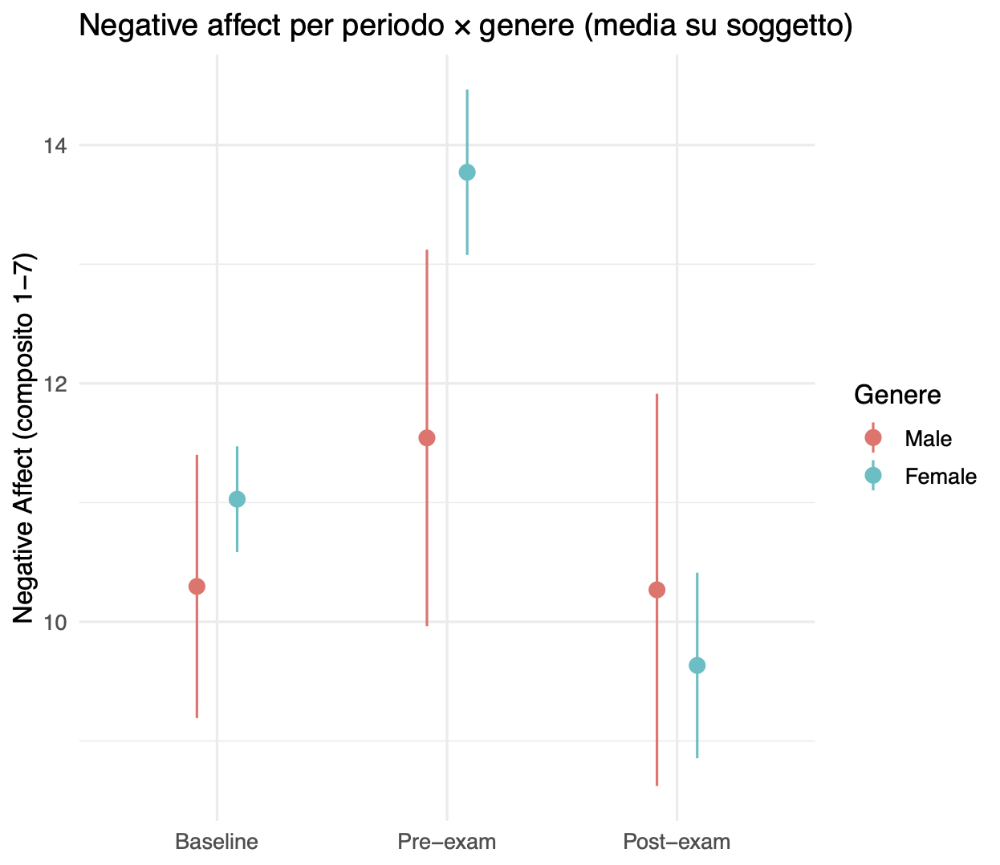
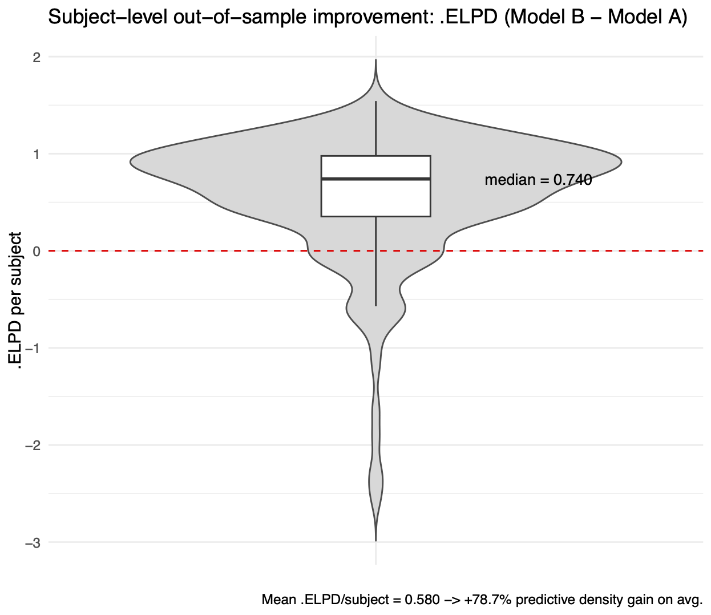

# Lo stress d’esame e la fragilità psicologica {#sec-delta_elpd}

## Introduzione

Il confronto tra i modelli statistici, quando viene presentato attraverso i formalismi della cross-validazione *leave-one-out* (LOO) e dell'*expected log predictive density* (ELPD), rischia di ridursi a un esercizio puramente tecnico. Questo capitolo adotta un approccio diverso: parte da una domanda di ricerca concreta e ben definita: chi è più vulnerabile allo stress d'esame? L'obiettivo è mostrare come gli strumenti di valutazione predittiva possano guidare una risposta empiricamente fondata.

L’analisi che segue ha il pregio di riguardare direttamente gli stessi studenti a cui il manuale è rivolto: i dati provengono infatti da una coorte di studenti di un  corso di laurea in psicologia. L’oggetto di indagine non è dunque un fenomeno lontano o astratto, ma un'esperienza concreta e universalmente riconosciuta nel contesto accademico: l'impatto emotivo degli esami universitari.

L’obiettivo non è quello di illustrare ancora una volta le formule che definiscono LOO o ELPD, ma di mostrare come tali strumenti possano guidare una decisione sostantiva. La questione è se, per spiegare le differenze individuali nella reattività allo stress, sia sufficiente considerare i tratti di personalità maladattiva misurati una volta soltanto (*baseline*), oppure se sia necessario integrare anche informazioni dinamiche raccolte in tempo reale tramite *Ecological Momentary Assessment* (EMA).

Il confronto tra modelli che qui proponiamo si sviluppa in tre passaggi: (i) la definizione del costrutto di *fragilità psicologica* e la sua operazionalizzazione tramite un composito di *negative affect*; (ii) la descrizione dei dati osservati nei tre periodi di rilevazione (baseline, pre-esame, post-esame); (iii) la valutazione predittiva di due modelli alternativi, uno fondato soltanto sui tratti stabili, l’altro arricchito dalle dinamiche di stato.

In tal modo diventa chiaro che la scelta tra modelli non è mai un fatto puramente tecnico. È invece una decisione sostantiva, che riguarda il modo in cui interpretiamo il fenomeno psicologico di interesse e, nel caso specifico, la misura in cui riteniamo che le componenti dinamiche della vita quotidiana aggiungano valore esplicativo ai tratti di base della personalità.

### Panoramica del capitolo {.unnumbered .unlisted}

In questo capitolo seguiamo un percorso in tre passaggi:

- **Definizione del costrutto**: chiarire cosa intendiamo per *fragilità psicologica* e come viene resa osservabile attraverso un composito di *negative affect*.
- **Descrizione dei dati**: osservare l’andamento del negative affect nei tre periodi di rilevazione (baseline, pre-esame, post-esame) e le differenze di genere a livello descrittivo.
- **Confronto tra modelli**: valutare, con PSIS-LOO ed ELPD, se le dinamiche EMA raccolte nel periodo *Pre* migliorano la capacità predittiva rispetto ai soli tratti di personalità baseline.

L’obiettivo è mostrare che il confronto tra modelli non è un esercizio tecnico fine a sé stesso, ma uno strumento per rispondere a domande sostantive e vicine all’esperienza degli studenti.

## Costrutto e misurazione: come “vediamo” la fragilità

La psicologia dello stress si confronta da sempre con un problema concettuale cruciale: ciò che intendiamo per *fragilità psicologica* [*psychological vulnerability*; @wright2012resilience] non è mai direttamente osservabile. Il costrutto deve essere reso empiricamente accessibile attraverso un insieme di indicatori, che fungono da proxy parziali e imperfetti del fenomeno.

La letteratura mostra con coerenza che le situazioni di valutazione — tra cui gli esami universitari — innescano un incremento transitorio dell’affetto negativo [@spangler2002students]. Studi basati su diari quotidiani e su campionamenti ripetuti confermano che, nei giorni immediatamente precedenti alla prova, le emozioni spiacevoli aumentano di intensità, mentre tendono a ridursi dopo che la prova è stata sostenuta. Questo andamento, seppur regolare, non è identico per tutti: alcuni individui mostrano un picco marcato, altri quasi nessuna variazione.

Nel nostro progetto, la fragilità psicologica è stata operazionalizzata tramite un indice di *negative affect* costruito a partire da quattro item di umore istantaneo (felice/infelice, soddisfatto/insoddisfatto, triste, arrabbiato), rilevati con metodologia EMA. L’EMA (*Ecological Momentary Assessment*) consente di registrare tali stati “nel momento”, riducendo i bias di ricordo e garantendo una validità ecologica superiore rispetto alle misure retrospettive [@shiffman2008ecological].

È importante sottolineare che questo composito non costituisce un accesso diretto al costrutto: non misura la fragilità in sé, ma ne offre una rappresentazione indiretta. In altre parole, osserviamo il fenomeno attraverso una lente che ne restituisce soltanto alcuni aspetti, e che introduce inevitabilmente una quota di errore e di riduzione della complessità. Proprio per questo, l’uso di strumenti statistici come il confronto predittivo tra modelli è essenziale: essi ci permettono di valutare se, nonostante le imperfezioni della misurazione, le nostre ipotesi teoriche producano previsioni utili e ben calibrate sui dati.

## I dati (in breve)

Per illustrare il problema, consideriamo un dataset raccolto su una coorte di studenti dello stesso Corso di Laurea. Le misure sono state ottenute tramite *Ecological Momentary Assessment (EMA)* in tre periodi distinti: *Baseline*, *Pre-esame*, *Post-esame*.

L’andamento del *negative affect* mostra una dinamica intuitiva: i valori tendono a crescere nel periodo *Pre* e a ridursi nel periodo *Post*. Si osservano inoltre differenze di genere, con punteggi mediamente più elevati riportati dalle studentesse in alcune fasi (Figura 1).

::: {#fig-gender-exam}
{ width=75% }

*Negative affect medio per periodo (Baseline, Pre, Post) distinto per genere. I valori rappresentano medie per soggetto.* 
:::

Questa prima descrizione offre un punto di partenza utile ma limitato. Mostra infatti che lo stress da esame si riflette nei dati di umore e che esistono differenze tra sottogruppi, ma non ci dice *quanto siano robuste queste differenze* né *quanto predicano bene la reattività dei singoli studenti*. Per rispondere a queste domande occorre spostarsi sul terreno dei modelli predittivi e della loro valutazione fuori campione.

## Due modelli, una domanda

La domanda centrale di questo progetto è semplice da formulare: *possiamo predire le differenze individuali nella reattività allo stress dell’esame?*

Per affrontarla abbiamo costruito due modelli alternativi:

* **Modello A (Baseline)**: utilizza soltanto i tratti di personalità misurati alla baseline, ovvero le cinque dimensioni del *PID-5* (Negative Affectivity, Detachment, Antagonism, Disinhibition, Psychoticism), insieme al genere. Si tratta di indicatori relativamente stabili, che riflettono predisposizioni maladattive note in letteratura [@al2016psychometric].
* **Modello B (Baseline + EMA)**: parte dal Modello A e aggiunge predittori dinamici, cioè misure di stato ricavate dalle traiettorie EMA raccolte durante il periodo *Pre*. Questi indici riflettono variazioni situate nel tempo, più sensibili ai cambiamenti di contesto.

La domanda cruciale è se le informazioni dinamiche EMA migliorino davvero la capacità predittiva rispetto ai soli tratti stabili. Per valutare questo aspetto, non basta guardare ai coefficienti stimati: occorre confrontare i modelli in termini di *qualità predittiva fuori campione*.

A questo scopo abbiamo usato il criterio *PSIS-LOO* per stimare l’*expected log predictive density (ELPD)*. Calcolando l’ELPD per ogni soggetto, possiamo derivare la differenza tra modelli:

$$
\Delta \text{ELPD}_s = \text{ELPD}_s(\text{Modello B}) - \text{ELPD}_s(\text{Modello A})
$$

Un valore positivo indica che il Modello B predice meglio per quel soggetto; un valore negativo segnala che il Modello A è sufficiente.

La distribuzione di questi ΔELPD a livello individuale è mostrata nella Figura 2.

::: {#fig-delta-elpd}
{ width=75% }

*Differenza di ELPD per soggetto (Modello B − Modello A). Ogni punto rappresenta uno studente; la linea a zero indica l'equivalenza statistica tra i due modelli.*
:::

Il risultato è chiaro:

* In media, il *Modello B* ottiene un *ELPD più alto*, segnalando che i predittori dinamici EMA aggiungono valore informativo.
* La distribuzione di ΔELPD è tuttavia eterogenea. Per molti studenti il guadagno è modesto, ma esiste una coda di casi in cui l’inclusione delle misure EMA produce un *miglioramento sostanziale* della predizione.
* Non mancano soggetti per cui le EMA non aiutano o addirittura peggiorano leggermente la predizione, a conferma che “migliore in media” non significa “migliore per tutti”.

Questa eterogeneità riflette bene il fenomeno psicologico in questione: la reattività allo stress varia notevolmente tra individui. Alcuni studenti appaiono relativamente resilienti, altri mostrano una maggiore fragilità, e sono proprio questi ultimi a trarre maggior beneficio da modelli che incorporano dinamiche situate nel tempo.

## Cosa mostrano i nostri dati

La Figura 2 illustra chiaramente il punto di forza dell’approccio predittivo. Il *Modello B*, che integra le misure dinamiche EMA, non solo migliora l’ELPD medio rispetto al Modello A, ma evidenzia anche *per chi* il guadagno è più marcato.

L’aspetto forse più interessante è l’eterogeneità dei risultati:

* Per molti studenti, il vantaggio dell’includere le EMA è modesto, segnalando che i tratti di personalità misurati alla baseline bastano a catturare la loro reattività allo stress.
* Per una quota significativa di studenti, tuttavia, l’aggiunta delle informazioni EMA porta a un miglioramento sostanziale della predizione. Questi casi corrispondono a soggetti più “fragili”, la cui traiettoria di affetto negativo durante il periodo *Pre* fornisce indizi cruciali.
* Alcuni studenti mostrano invece ΔELPD negativi: per loro, le misure EMA introducono rumore piuttosto che informazione utile.

Questa distribuzione non simmetrica dei ΔELPD è un risultato sostantivo. Essa suggerisce che le misure dinamiche catturate “nel momento” non sono semplicemente un’aggiunta marginale, ma rappresentano un indicatore sensibile delle differenze individuali nella gestione dello stress d’esame.

Dal punto di vista psicologico, il risultato si collega a una letteratura ampia che documenta come le persone differiscano nella loro *capacità di regolazione emotiva* e nella *resilienza allo stress accademico*. Studi longitudinali mostrano che le misure raccolte in *situ* (come l’EMA) sono spesso predittori più accurati dei questionari di tratto somministrati una tantum, proprio perché catturano variazioni situate e contestuali. Qui osserviamo lo stesso principio: le dinamiche momentanee anticipano meglio chi vivrà uno stress maggiore.

In sintesi:

* Il confronto tra i due modelli non è solo una questione statistica, ma evidenzia differenze psicologicamente rilevanti.
* Per progettare interventi di supporto, le misure dinamiche EMA permettono di identificare con maggiore precisione gli studenti più vulnerabili.
* L’uso di ΔELPD a livello individuale ci ricorda che le decisioni sui modelli hanno ricadute concrete sul modo in cui interpretiamo i dati psicologici.

## Limiti e cautele

Come sempre, anche i risultati più promettenti richiedono prudenza nell’interpretazione. Nel nostro caso, tre punti meritano attenzione.

*Primo, l’operazionalizzazione del costrutto.* La fragilità psicologica è stata definita attraverso un punteggio composito di affetto negativo, ottenuto combinando quattro item EMA di umore istantaneo. Questa scelta riflette la necessità, comune in psicometria, di ricorrere a proxy. Non abbiamo accesso diretto al costrutto teorico, ma a indicatori osservabili che ne catturano solo una parte. Altri strumenti o combinazioni di item potrebbero condurre a stime differenti.

*Secondo, la copertura dei periodi.* La precisione della stima di ΔELPD per soggetto dipende dal numero e dalla distribuzione delle osservazioni disponibili nei tre momenti (Baseline, Pre, Post). Studenti con poche rilevazioni in uno dei periodi contribuiscono con maggiore incertezza, e questo si riflette nella variabilità dei guadagni predittivi.

*Terzo, il significato causale.* L’analisi con PSIS-LOO risponde a una domanda predittiva: *quale modello anticipa meglio dati lasciati fuori campione?* Non risponde invece alla domanda *perché* si osservano differenze individuali nella reattività allo stress. Le dinamiche EMA migliorano la predizione, ma non possiamo inferire un nesso causale tra quei segnali momentanei e l’aumento dell’affetto negativo.

Queste cautele non riducono l’importanza del risultato. Al contrario, ci ricordano che la forza di questo tipo di analisi non sta nel proporre spiegazioni definitive, ma nel fornire strumenti predittivi più accurati e quindi utili per la ricerca applicata.

## Riflessioni conclusive {.unnumbered .unlisted}

Il percorso che abbiamo seguito in questo capitolo mostra un punto essenziale: gli strumenti per il confronto tra modelli, come PSIS-LOO e l’ELPD, non sono semplici formalismi statistici, ma strumenti che ci aiutano a rispondere a domande concrete. Nel nostro esempio, la questione era riconoscibile e vicina agli studenti stessi: come varia la fragilità psicologica nei giorni dell’esame, e in che misura i segnali dinamici raccolti *nel momento* aggiungono valore predittivo rispetto alle misure di tratto raccolte a baseline?

L’analisi ha evidenziato due insegnamenti complementari. Da un lato, i modelli che includono variabili dinamiche (EMA) offrono un chiaro vantaggio predittivo medio rispetto a quelli che considerano solo i tratti stabili. Dall’altro lato, l'analisi dei valori individuale di ΔELPD mostra che questo vantaggio non è uniforme: alcuni studenti beneficiano molto dell’informazione aggiuntiva, altri poco o per nulla. Questo ricorda che il criterio “migliore in media” non coincide sempre con “migliore per tutti”.

Più in generale, l’esempio illustra come la logica predittiva consenta di mantenere un equilibrio fra rigore metodologico e rilevanza applicativa. Lungi dall’essere un esercizio astratto, il confronto tra modelli predittivi apre la strada a una comprensione più sfumata delle differenze individuali e, di conseguenza, a interventi più mirati. Per gli studenti di psicologia, questo significa che l’uso di strumenti bayesiani non serve solo a padroneggiare tecniche avanzate, ma a sviluppare un atteggiamento critico e informato: scegliere modelli non perché “più eleganti” o “più complessi”, ma perché più capaci di anticipare ciò che accade realmente nelle persone e nei contesti.

In definitiva, la lezione metodologica e sostantiva coincidono: la predizione fuori campione è il banco di prova più solido per valutare i nostri modelli, e applicarla a dati che toccano da vicino l’esperienza degli studenti dimostra concretamente la sua utilità.

## Bibliografia {.unnumbered .unlisted}

