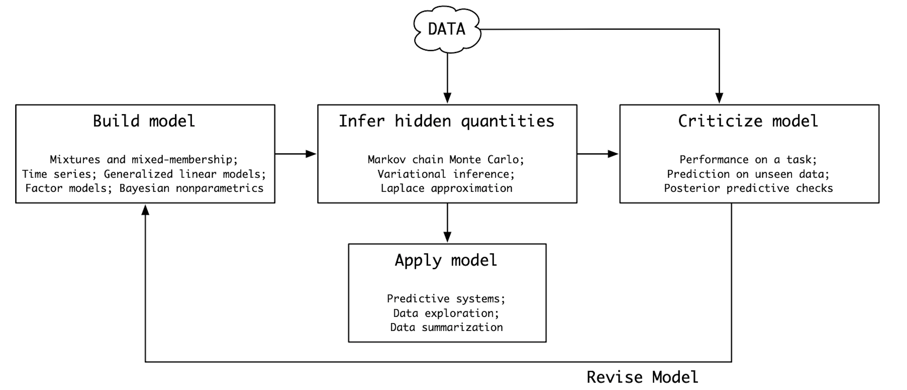

# Flusso di lavoro bayesiano {#sec-mcmc-workflow}

::: {.callout-note appearance="minimal"}
Abbiamo ormai gli strumenti fondamentali per affrontare l’inferenza bayesiana in contesti realistici. Abbiamo visto che, nei casi semplici, l’aggiornamento può essere calcolato analiticamente, ma che diventa impraticabile già con pochi parametri. Abbiamo introdotto l’algoritmo di Metropolis che ci ha mostrato come sia sempre possibile campionare dalla distribuzione a posteriori e poi abbiamo visto come i linguaggi probabilistici, in particolare Stan, rendano questa possibilità accessibile e utilizzabile nella ricerca psicologica.

Ora, però, dobbiamo fare un passo ulteriore. Avere strumenti di calcolo non basta: serve un metodo di lavoro. L’inferenza bayesiana non è solo una formula o un algoritmo, ma un processo che accompagna il ricercatore dall'ideazione del modello fino alla comunicazione dei risultati. Questo processo prende il nome di *workflow bayesiano*.
:::

::: {.callout-tip}
## Prerequisiti

Può essere utile aver letto [Bulbulia (2023)](https://www.researchgate.net/profile/Joseph-Bulbulia/publication/361799820_A_workflow_for_causal_inference_in_cross-cultural_psychology-A-workflow-for-causal-inference-in-cross-cultural-psychology/links/62c5cad2f8c0fc18d3ec9798/A-workflow-for-causal-inference-in-cross-cultural-psychology-A-workflow-for-causal-inference-in-cross-cultural-psychology.pdf) sul flusso di lavoro bayesiano e l'inferenza causale.
:::

## Un processo iterativo

Il flusso di lavoro bayesiano non è lineare, ma iterativo. Inizia con la formulazione di un modello, prosegue con l’analisi dei dati e la valutazione dei risultati, ma spesso richiede di tornare indietro, rivedere le ipotesi e migliorare le specifiche. A differenza dell'approccio frequentista tradizionale, che tende a concentrarsi solo sull'output numerico finale (ad esempio un valore-$p$), l’approccio bayesiano incoraggia una riflessione costante sul legame tra teoria, modello e dati.

L'idea centrale è che ogni modello è un'ipotesi sul processo generativo che ha prodotto i dati. Il compito del ricercatore non è solo quello di stimare i parametri, ma anche di verificare se il modello che li definisce è coerente con ciò che sappiamo e con ciò che osserviamo.

## Le fasi del workflow

Il flusso di lavoro può essere schematizzato in tre fasi principali che, nella pratica, si intrecciano continuamente.

**1. Definizione del modello:**
il punto di partenza è sempre la teoria o l’ipotesi psicologica che vogliamo testare. In questa fase, traduciamo le nostre idee in un modello probabilistico, definendo i parametri, scegliendo i priori e specificando la verosimiglianza. È il momento in cui ci si chiede: "*Quale processo potrebbe aver generato i dati che osserviamo?*".

**2. Inferenza e stima.**
Una volta definito il modello, utilizziamo strumenti come Stan per ottenere dei campioni dalla distribuzione a posteriori. In questa fase, verifichiamo la tecnica di campionamento (convergenza delle catene, numero effettivo di campioni indipendenti e diagnosi di autocorrelazione). È qui che la potenza degli algoritmi MCMC diventa essenziale, in quanto ci permette di trattare modelli complessi senza dover ricorrere a eccessive semplificazioni.

**3. Valutazione del modello**
Il passo successivo è chiedersi se il modello "funziona". Ciò significa, da un lato, confrontare le previsioni del modello con i dati osservati (*posterior predictive checks*) e, dall'altro, valutare la capacità del modello di generalizzare a nuovi dati (ad esempio, tramite LOO-CV). La valutazione non è mai definitiva, ma una guida per decidere se mantenere, modificare o sostituire il modello.

## Una prospettiva cumulativa

Il flusso di lavoro bayesiano ci ricorda che la scienza non procede verso verità definitive, ma verso modelli progressivamente migliori. Ogni modello rappresenta un passo in un percorso cumulativo in cui le ipotesi vengono testate, confrontate e, se necessario, abbandonate.

Dal punto di vista della psicologia, questo approccio rappresenta una risposta concreta alla crisi di replicazione. Non ci limitiamo a verificare le associazioni statistiche, ma costruiamo modelli espliciti dei processi psicologici, li testiamo sui dati e li confrontiamo in termini di capacità predittiva. Questo metodo promuove la trasparenza, l'apertura alla revisione e la cumulatività, tutti elementi essenziali per rafforzare le basi empiriche della disciplina.

## Riflessioni conclusive {.unnumbered .unlisted}

Con il flusso di lavoro bayesiano abbiamo completato il nostro percorso introduttivo all'inferenza bayesiana. Abbiamo capito che non si tratta solo di imparare un nuovo insieme di tecniche, ma di adottare una prospettiva diversa sul rapporto tra teoria, dati e analisi statistica.

Il valore di questo approccio non risiede solo nei dettagli tecnici, ma nel modo in cui ci spinge a pensare: ogni modello è un'ipotesi esplicita, ogni analisi è trasparente e riproducibile e ogni risultato è accompagnato da una valutazione critica della sua incertezza e plausibilità.

Nei capitoli successivi vedremo come applicare questi principi a casi specifici e a modelli più complessi. Il workflow bayesiano rimarrà il filo conduttore: un metodo iterativo e riflessivo che ci guiderà nella costruzione di una conoscenza scientifica solida, cumulativa e in grado di rispondere alle sfide della psicologia contemporanea.

## Bibliografia {.unnumbered .unlisted}
