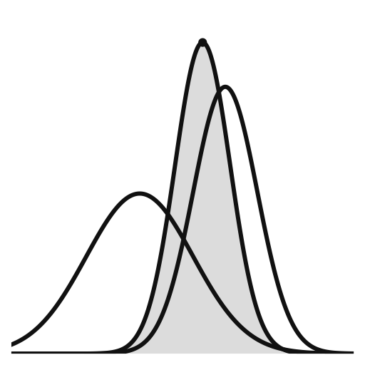

{width=220px style="display:block;margin:auto;"}

Questo portale costituisce un sito di accompagnamento (*companion site*) al manuale **Inferenza bayesiana in psicologia: ragionare con l’incertezza**, pensato come spazio dedicato all’approfondimento operativo. Qui trovate esempi supplementari implementati in R e Stan, chiarimenti concettuali, note sul workflow bayesiano e collegamenti a materiali correlati, come richiami di teoria della probabilità, elementi di inferenza frequentista e analisi esplorativa dei dati (EDA).

## L'arco narrativo del companion {.unnumbered .unlisted}

Il percorso del *companion* segue un filo logico che parte dalla constatazione di un problema (la **crisi** della non replicabilità dei risultati in psicologia) e arriva a una **soluzione operativa** (la modellazione bayesiana come strumento per una scienza più solida e cumulativa).

```{r}
#| echo: false
library(dplyr)
library(gt)

arco <- tibble::tribble(
  ~Fase, ~Descrizione,
  "1. Crisi", "La psicologia si confronta con una crisi di replicabilità: scoperte fondamentali non si ripetono. Il paradigma statistico dominante (frequentista) rivela i suoi limiti strutturali.",
  "2. Diagnosi", "Il problema è anche concettuale: manca un linguaggio per quantificare l’incertezza. Il valore-p risponde a una domanda diversa da quella realmente rilevante per la ricerca.",
  "3. Svolta", "L’inferenza bayesiana propone un quadro coerente: probabilità come grado di credenza razionale, aggiornata tramite il teorema di Bayes.",
  "4. Calcolo", "Stan e i linguaggi probabilistici rendono l’inferenza bayesiana accessibile, trasparente e riproducibile.",
  "5. Modelli", "Si apprendono le basi: regressioni bayesiane per descrivere relazioni e confrontare gruppi.",
  "6. Estensioni", "Il framework si amplia con i GLM, adatti a dati categorici e di conteggio.",
  "7. Applicazione", "Si costruiscono modelli più ricchi: multilivello, gerarchici e processuali basati su meccanismi cognitivi.",
  "8. Valutazione", "Si confrontano i modelli tramite criteri predittivi, superando la logica del p < .05.",
  "9. Visione", "Verso una psicologia cumulativa e generativa: i modelli spiegano, prevedono e contribuiscono alla teoria."
)

arco %>%
  gt() %>%
  tab_header(
    title = md("**Dalla crisi di replicabilità alla modellazione bayesiana**")
  ) %>%
  tab_style(
    style = list(
      cell_fill(color = "#f6f6f6"),
      cell_borders(sides = "all", color = "white")
    ),
    locations = cells_body(columns = 1)
  ) %>%
  tab_style(
    style = list(
      cell_text(weight = "bold", color = "#1a364c")
    ),
    locations = cells_body(columns = 1)
  ) %>%
  cols_width(everything() ~ px(430)) %>%
  # opt_table_font(
  #   font = list(gt::google_font("Fira Sans"), default_fonts())
  # ) %>%
  opt_table_lines("none") %>%
  opt_row_striping() %>%
  tab_options(
    table.background.color = "white",
    column_labels.font.weight = "bold",
    data_row.padding = px(8)
  )
```

*Ogni sezione integra il manuale senza ripeterne i contenuti, ma ampliandoli con esempi commentati e riproducibili.*.

## Moduli propedeutici {.unnumbered .unlisted}

Per chi desidera un ripasso preliminare, sono disponibili tre percorsi di supporto:

- **Elementi di teoria della probabilità** → <https://ccaudek.github.io/utet-prob/>  
- **EDA (analisi esplorativa dei dati)** → <https://ccaudek.github.io/utet-eda/>
- **Inferenza frequentista** → <https://ccaudek.github.io/utet-frequentista/>

## Come usare questo portale {.unnumbered .unlisted}

Il companion è concepito come uno strumento di apprendimento *attivo*. Consente progressi reali solo se chi lo utilizza:
  
* **esegue personalmente gli script presentati**,
* **sperimenta variando parametri e opzioni**,
* **osserva come cambiano le stime e le diagnostiche**.

Questo approccio sviluppa una comprensione *intuitiva e profonda*, che supera la mera applicazione meccanica delle tecniche.

## Strumenti necessari {.unnumbered .unlisted}

* **R ≥ 4.5** (consigliato RStudio).
* **CmdStan** via `cmdstanr` → guida: [https://mc-stan.org/docs/cmdstan-guide/installation.html](https://mc-stan.org/docs/cmdstan-guide/installation.html).
* Pacchetti principali: `tidyverse`, `brms`, `cmdstanr`, `loo`.
* **Quarto** per la produzione di report riproducibili.

## Licenza d’uso {.unnumbered .unlisted}

Materiali rilasciati con licenza  
[CC BY-NC-ND 4.0](https://creativecommons.org/licenses/by-nc-nd/4.0/deed.it):  
è consentita la condivisione con attribuzione **solo per usi non commerciali** e **senza modifiche**.
